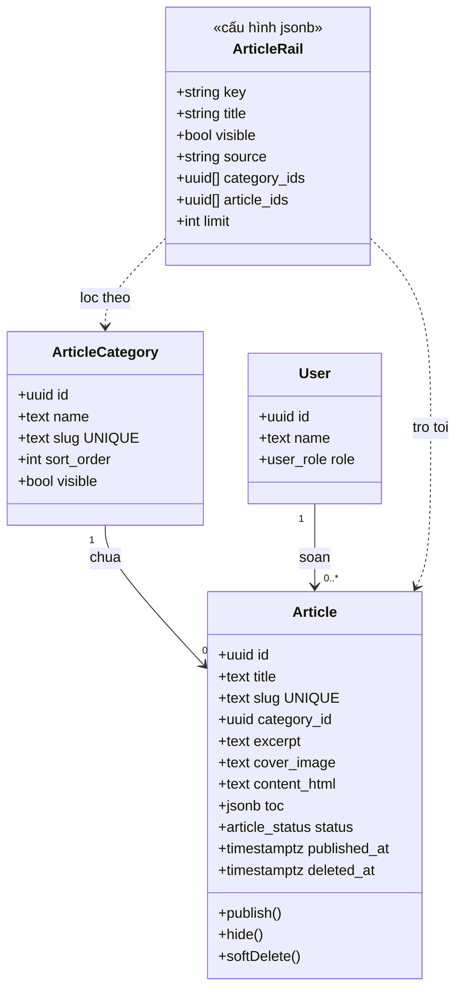
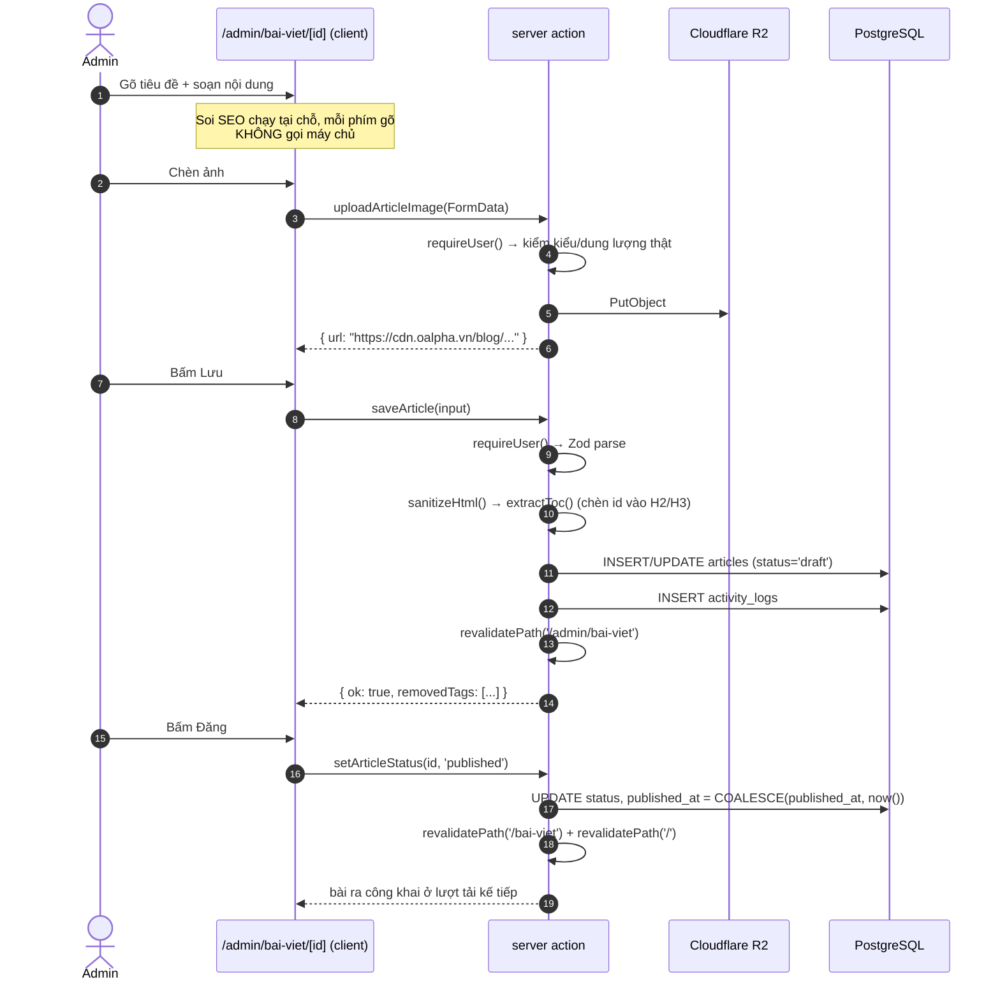
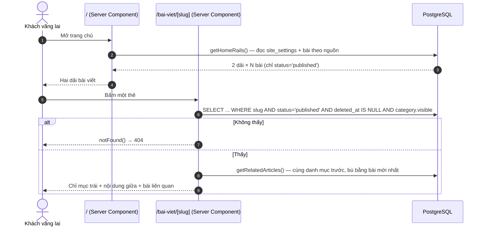

# Domain: Nội dung & Bài viết (Content / Article)

> **Hệ thống:** website OAlpha — repo `novaix-website`. Một ứng dụng **Next.js 14 App Router** duy
> nhất: không backend riêng, không hàng đợi, không worker. Xem
> [coding-style](../../conventions/coding-style.md) để biết ranh giới tầng.
>
> **Trạng thái:** 📝 thiết kế — chưa viết dòng code nào. Tài liệu này là **gốc**; PRD/RFC/Spec/Tasks
> nằm ở [`features/blog/`](../features/blog/).
>
> **Mã FR:** nhóm **B** (`FR-B01`…`FR-B14`).

---

# 1. Domain Overview (Tổng quan phân hệ)

## 1.1 Bài toán

Website OAlpha hiện chỉ **giới thiệu được mình một lần**, không kể tiếp được chuyện gì. Ba khoảng
trống cụ thể, đo được trên mã nguồn hiện tại:

1. **Không có nơi đăng nội dung dài.** Khách doanh nghiệp cân nhắc CRM/ERP hàng tháng trời và hỏi
   rất nhiều trước khi ký: triển khai mất bao lâu, dữ liệu Excel cũ chuyển sang thế nào, ERP khác
   phần mềm kế toán ra sao, chi phí thật gồm những gì. Website không có một dòng nào trả lời. Sale
   gõ tay lại cùng một đoạn cho từng khách qua Zalo.

2. **Toàn bộ nội dung đang nằm trong mã nguồn.** `lib/data.ts` giữ hết chữ của trang chủ — 9 module,
   5 bước triển khai, 3 cảm nhận khách hàng, bảng giá, FAQ. Sửa một câu mô tả phải: sửa mã → commit
   → build → deploy → chờ. Không ai ngoài lập trình viên đổi được. Đây là chỗ nghẽn **hằng tuần**
   của một trang marketing đang chạy thật.

3. **🔴 Khu quản trị đang hứa một tính năng không tồn tại.** Menu `/admin` đã có mục **"Bài viết"** và
   **"Giao diện trang chủ"** (`lib/admin/menu.ts`), bấm vào ra màn `ComingSoon`. Người dùng nội bộ
   nhìn thấy đường vào, tưởng sắp có, và không biết "sắp" là bao giờ.

Điểm 3 nhẹ hơn hẳn kiểu hỏng "im lặng" thường gặp — màn `ComingSoon` **nói thật**, nó không giả vờ
lưu thành công rồi nuốt dữ liệu. Nhưng nó vẫn là một lời hứa đang treo, và phân hệ này là chỗ trả.

## 1.2 Mục tiêu cốt lõi

- **Một nơi duy nhất soạn nội dung** cho toàn website (bài viết, chính sách, trang giới thiệu).
- **Nội dung ra tới khách được** — có tuyến công khai, có dải bài trên trang chủ, có trang đọc.
- **Admin tự chủ**: đổi nội dung, đổi thứ tự, ẩn/hiện — **không cần deploy**.
- **Bài viết tìm được trên Google** — sitemap, dữ liệu có cấu trúc, thẻ chia sẻ đúng.

## 1.3 Stack & tích hợp

Phân hệ này **không thêm tầng mới**. Nó chạy trên đúng bộ đã có:

| Việc | Dùng gì | Ghi chú |
| :-- | :-- | :-- |
| Đọc/ghi dữ liệu | **Drizzle + PostgreSQL** (`lib/db`) | Thêm 4 bảng, không đổi bảng `users` |
| Nghiệp vụ | **Server Action** (`lib/blog/*-actions.ts`) | Không dựng REST API — dự án không có tầng đó |
| Kiểm quyền | `requireUser()` / vai trò từ DB (`lib/auth/session.ts`) | **Dùng lại, không viết lớp thứ hai** |
| Giao diện quản trị | **MUI 6** + `@tabler/icons-react` | Khuôn có sẵn: `PageHeader`, `AdminShell` |
| Giao diện công khai | **Tailwind** + token `app/globals.css` | Nền tối, `framer-motion` cho hiệu ứng vào |
| SEO | **Metadata API của Next 14** + `app/sitemap.ts` | Không thư viện |

**Ba thứ là công nghệ MỚI**, phải cập nhật [`tech-stack.md`](../../architecture/tech-stack.md) —
không được để nợ:

| Mới | Vì sao cần |
| :-- | :-- |
| **`sanitize-html`** | Làm sạch HTML người soạn. Hàng rào bảo mật, xem §4.2 |
| **Trình soạn thảo rich-text** (Tiptap hoặc TinyMCE 6) | Chưa chốt — xem §4.6 |
| **`@aws-sdk/client-s3`** | Đẩy ảnh lên Cloudflare R2. `.env.example` đã khai `R2_*` nhưng **chưa có dòng code nào dùng** |

---

# 2. Sub-systems & Feature Breakdown

| # | Nhóm tính năng | Mô tả | FR | Bảng |
| :-- | :-- | :-- | :-- | :-- |
| 1 | **Quản lý bài viết** | Tạo · sửa · xóa mềm · khôi phục · đổi trạng thái | FR-B01, FR-B06 | `articles` |
| 2 | **Danh mục bài viết** | Nhóm bài theo chủ đề; một bài **một** danh mục | FR-B02 | `article_categories` |
| 3 | **Soạn thảo** | Rich-text, chèn ảnh, làm sạch ở máy chủ | FR-B03, FR-B10 | — |
| 4 | **Mục lục (chỉ mục)** | Tự rút từ H2/H3 lúc lưu, sinh `id` neo | FR-B04 | `articles.toc` |
| 5 | **Soi SEO khi soạn** | Gợi ý tại chỗ theo từ khóa chính — **luật đếm được, chạy ở trình duyệt** | FR-B05 | — |
| 6 | **Trưng bày trang chủ** | Hai dải bài cấu hình được | FR-B07 | `site_settings` |
| 7 | **Trang đọc** | Chỉ mục trái · nội dung giữa | FR-B08 | — |
| 8 | **Danh sách + menu** | `/bai-viet` có lọc, phân trang, mục menu | FR-B09 | — |
| 9 | **Nhật ký** | Ghi vết mọi thao tác nội dung | FR-B11 | `activity_logs` |
| 10 | **SEO** | sitemap.xml · JSON-LD · Open Graph | FR-B12 | — |
| 11 | **Ảnh trong bài** | Upload lên R2 qua một đường duy nhất | FR-B13 | — |
| 12 | **Thay nội dung cứng** | Đưa phần chữ dài ra khỏi `lib/data.ts` | FR-B14 | — |

Nhóm 1–5, 9 là **quản trị** (`/admin`), nhóm 6–8, 10 là **công khai**, nhóm 11–12 là **hạ tầng**.

---

# 3. Ubiquitous Language (Ngôn ngữ thống nhất)

| Thuật ngữ | Tiếng Việt | Định nghĩa & phạm vi |
| :-- | :-- | :-- |
| **Article** | Bài viết | Một đơn vị nội dung có tiêu đề, slug, thân HTML, một danh mục, một trạng thái. **Aggregate Root.** |
| **ArticleCategory** | Danh mục bài viết | Nhóm chủ đề (*Giới thiệu*, *Chính sách*, *Kiến thức*…). Một bài thuộc **đúng một** danh mục. |
| **TOC / Outline** | Mục lục · chỉ mục | Danh sách đề mục H2/H3 trong thân bài, mỗi mục có `id` neo. **Sinh ở máy chủ lúc lưu**, không tính lại ở trình duyệt. |
| **Status** | Trạng thái đăng | `draft` (nháp) · `published` (đã đăng) · `hidden` (ẩn). Chỉ `published` ra công khai. |
| **Rail** | Dải bài viết | Một khối bài viết trên trang chủ. Trang chủ có **hai** dải độc lập. |
| **Rail source** | Nguồn của dải | Cách một dải chọn bài: `category` (N bài mới nhất của các danh mục đã chọn) hoặc `manual` (Admin xếp từng bài). |
| **Cover** | Ảnh bìa | Ảnh đại diện của bài, hiện trên thẻ và đầu trang đọc. |
| **Excerpt** | Mô tả ngắn | 1–2 câu tóm tắt, hiện trên thẻ và trong `<meta description>`. |
| **Readiness** | Mức sẵn sàng | Tỷ lệ **gợi ý SEO đã theo được** (§4.7). 🔴 Không phải điểm chất lượng bài viết, không phải điều kiện đăng. |
| **Structured data** | Dữ liệu có cấu trúc | JSON-LD kiểu `Article` / `BreadcrumbList` nhúng vào trang đọc để Google hiểu nội dung. |

🔴 **"Bài viết" KHÔNG phải "nội dung trang chủ".** Chữ trong `lib/data.ts` (tên module, bước triển
khai, bảng giá) là **cấu trúc của trang marketing**, không phải bài viết — nó có bố cục riêng, không
có slug, không đọc tuần tự. Đừng nhét vào `articles` vì "đều là chữ". Ranh giới ở §4.8.

---

# 4. Architecture Design & Core Decisions

## 4.1 Không dựng tầng API — dùng thẳng Server Component + Server Action

Đây là khác biệt lớn nhất so với mọi tài liệu thiết kế kiểu cũ, và nó phải nói ngay từ đầu để không
ai đi xây `/api/v1/articles`.

```text
Trang công khai (Server Component)  ──► lib/blog/queries.ts ──► Drizzle ──► PostgreSQL
Màn quản trị (Client Component)     ──► server action       ──► Drizzle ──► PostgreSQL
```

- **Trang công khai đọc thẳng database trong Server Component.** Không `fetch`, không route handler,
  không JSON đi vòng. Route handler duy nhất của repo là `app/api/auth/[...nextauth]` và nó ở đó vì
  Auth.js đòi, không phải vì kiến trúc.
- **Màn quản trị ghi qua server action.** Bốn nhịp bắt buộc: **kiểm quyền → validate Zod → thao tác →
  `revalidatePath`**.

Vì sao không có API: thêm một tầng HTTP giữa hai thứ chạy **trong cùng một tiến trình** chỉ đẻ ra
việc — tuần tự hóa, một bộ DTO thứ hai, một chỗ kiểm quyền thứ hai sẽ trôi khỏi chỗ thứ nhất. Website
này không có ứng dụng di động, không có bên thứ ba gọi vào. Ngày nào có, lúc đó dựng, và dựng bằng
route handler bọc chính các hàm ở `lib/blog/`.

## 4.2 🔴 Làm sạch HTML là hàng rào bảo mật, không phải bước định dạng

Nội dung do người soạn gõ vào rồi hiện cho **khách vãng lai** là bề mặt tấn công XSS lớn nhất mà
website này sẽ có. Ba luật cứng:

1. **Làm sạch ở MÁY CHỦ, lúc GHI.** `articles.content_html` trong DB **luôn là bản đã sạch**.
2. **Không làm sạch lúc đọc.** Làm sạch lúc đọc nghĩa là mỗi tuyến đọc phải nhớ gọi — và tuyến nào
   quên là một lỗ XSS. Sẽ có tuyến quên: trang đọc, dải trang chủ, RSS, bản xem trước.
3. **Dùng `sanitize-html`, không tự viết regex.** Regex không hiểu cấu trúc lồng nhau; nó thua trước
   ``, thuộc tính không dấu nháy, ký tự điều khiển chèn giữa tên thuộc tính.

Allowlist **khai theo hướng cấm sạch rồi mở từng thứ** (`'*': []`), không phải chặn từng thứ xấu.
Cấu hình chi tiết ở [RFC §5.2](../features/blog/blog-rfc.md#52-làm-sạch-html).

Ba điểm cố ý trong allowlist, ghi ở đây vì chúng là **nghiệp vụ**, không phải chi tiết thi công:

| Điểm | Vì sao |
| :-- | :-- |
| **Không cho `<h1>`** | Trang đọc render `<h1>` từ `title`. Hai `h1` trên một trang là hỏng ngữ nghĩa và SEO. Mục lục cũng chỉ rút H2/H3. |
| **Không cho `style`** | `style` cho phép che phủ giao diện (`position:fixed`) và là đường vào `url(javascript:…)` trên trình duyệt cũ. Kích thước ảnh cho qua `width`/`height` là đủ. |
| **`src` của ảnh phải là ảnh của chính mình** | Ảnh trỏ ra host lạ sẽ chết khi bên kia xóa (bài thủng lỗ sau vài tháng) và rò referrer của khách sang đó. |

## 4.3 Mục lục sinh ở MÁY CHỦ, lưu vào cột

Lúc lưu bài: đọc thân HTML đã sạch → tìm `h2`/`h3` → sinh slug từ chữ (bỏ dấu, gạch nối, thêm hậu tố
`-2` khi trùng) → **ghi `id` vào chính thẻ** → lưu cây mục lục vào `articles.toc` (jsonb).

Ba lý do không tính ở trình duyệt:

1. **Neo phải ỔN ĐỊNH.** Người ta gửi link `/bai-viet/trien-khai-erp#chi-phi-that`. Sinh lại ở client
   mỗi lần tải là neo có thể đổi khi thuật toán slug đổi → link chết **im lặng**.
2. **Hydrate.** Máy chủ render một đằng, client tính một nẻo → React báo lỗi hydrate.
3. **Đọc rẻ.** Trang đọc chỉ `SELECT toc`, không phải parse HTML mỗi lượt.

⚠️ Slug tiếng Việt phải xử **`đ` riêng**: `NFD` tách được dấu thanh nhưng **không** tách `đ` → `d`.
Bỏ sót là `"Đầu tư"` ra `#u-tu`.

## 4.4 Hai dải bài trên trang chủ là CẤU HÌNH, không phải hai bảng

Yêu cầu *"một dải giới thiệu/chính sách, một dải kiến thức"* **không** dẫn tới hai loại bài viết. Nó
dẫn tới **hai khối cấu hình** trong `site_settings`, mỗi khối tự chọn nguồn bài.

Vì sao: nếu đóng cứng "dải 1 = giới thiệu, dải 2 = kiến thức" vào schema thì tháng sau muốn thêm dải
"Câu chuyện khách hàng" phải sửa DB + deploy — đúng thứ mà cả phân hệ này đang chống. Còn nếu là cấu
hình thì thêm dải là một phần tử trong mảng jsonb.

Đây cũng là lý do màn **"Giao diện trang chủ"** (`/admin/giao-dien`, hiện là `ComingSoon`) có lý do
tồn tại thật, chứ không phải một mục menu để trống.

## 4.5 Xóa mềm, có thùng rác

`articles.deleted_at IS NULL` = còn sống. Nội dung dài là thứ mất đi **không dựng lại được từ trí
nhớ** — khác hẳn một dòng cấu hình gõ lại trong 10 giây.

`slug` giữ `UNIQUE` trên **toàn bảng**, kể cả bài đã xóa mềm. Đánh đổi có chủ ý: bài trong thùng rác
vẫn giữ slug của nó, muốn dùng lại slug đó phải xóa cứng. Đổi lại, **khôi phục không bao giờ vỡ** —
nếu slug được thả tự do khi xóa, một bài mới chiếm mất slug là bài cũ không khôi phục nổi, và người
dùng nhận thông báo lỗi vào đúng lúc họ đang cứu dữ liệu.

## 4.6 ⚠️ Trình soạn thảo — điểm cần CHỐT trước khi code

Repo chưa có trình soạn thảo nào. Hai ứng viên:

| PA | Lựa chọn | Đánh đổi |
| :-- | :-- | :-- |
| **A** ⭐ | **Tiptap** (MIT, `@tiptap/react`) | Giấy phép sạch và ổn định, nhẹ, xuất HTML sạch, hợp React 18 + MUI. **Phải tự dựng thanh công cụ** (~150 dòng). |
| **B** | **TinyMCE 6** (MIT, self-host) | Có sẵn thanh công cụ đầy đủ, quen tay với người dùng văn phòng. **v6 không còn nhận tính năng mới**, và ⚠️ **v7 đã đổi sang GPLv2+** — phải mở `LICENSE.txt` trong gói npm đọc ngay sau khi cài, không tin trí nhớ. |

🔴 **Không dùng bản Cloud/CDN của bất kỳ trình soạn thảo nào** (gắn API key, tải script từ host
ngoài): nó chết khi mất mạng ra ngoài và làm rối bất kỳ chính sách CSP nào thêm về sau.

Dù chọn PA nào, **HTML ra khỏi trình soạn thảo vẫn phải qua `sanitize-html` ở máy chủ**. Trình soạn
thảo là tiện nghi cho người gõ, **không phải** hàng rào bảo mật — nó chạy ở trình duyệt, nơi mọi thứ
sửa được.

## 4.7 Soi SEO khi soạn — luật đếm được (FR-B05)

Người soạn ở đây là nhân viên marketing hoặc sale, không phải người làm SEO. Họ không biết Google cắt
tiêu đề ở đâu, `alt` để làm gì, vì sao bài không có đề mục lại khó đọc. Khối **Soi SEO** ở cột phải
màn soạn thảo trả lời đúng những câu đó, **tại chỗ, theo từng ký tự gõ vào**.

**Chạy hoàn toàn ở trình duyệt**, lõi thuần `lib/blog/seo-check.ts`. Không gọi máy chủ, không tốn một
đồng nào. Mỗi luật là một phép đếm: độ dài tiêu đề, độ dài mô tả, số từ,
có ảnh bìa chưa, ảnh trong bài có `alt` chưa, có đề mục H2 chưa, từ khóa chính có xuất hiện trong
tiêu đề / mô tả / đề mục / 100 chữ đầu không.

🔴 **GỢI Ý, không phải bảng chấm.** Ba thứ cố ý không làm — đây là phần quan trọng nhất của mục này:

| Không làm | Vì sao |
| :-- | :-- |
| Không **chặn đăng** khi chưa "đạt" | Bài chính sách 180 chữ là ĐÚNG độ dài của nó. Chặn vì "chưa đủ 300 từ" là bắt người soạn nhồi chữ cho qua cửa — bài tệ đi, không tốt lên. |
| Không hiện **điểm số lớn màu đỏ** | Một con số kèm màu đỏ biến việc viết thành trò ăn điểm: người soạn tối ưu cho con số thay vì cho người đọc. Đó đúng là thứ Google phạt. |
| Không **tự sửa bài** | Mỗi gợi ý nói *hiện trạng đo được* + *vì sao* + *sửa thế nào*. Sửa hay bỏ qua là quyết định của người viết. |

Thanh **"Mức sẵn sàng"** (0–100%) chỉ để xếp thứ tự việc cần làm — nó đo *đã theo được bao nhiêu
phần gợi ý*, **không đo bài hay hay dở**. Ngưỡng chỉnh được và **tắt được từng luật**; 🔴 luật đã tắt
phải rời khỏi **cả mẫu số**, nếu không tắt một luật lại làm thanh tụt xuống và người dùng học được
rằng tắt luật là bị phạt.

⚠️ So khớp từ khóa phải **bỏ dấu** và **theo ranh giới từ**. Không có ranh giới từ thì `erp` khớp
trúng giữa `enterprise`, và `"kho"` khớp trong `"khó"`. Cùng cái bẫy `đ` ở §4.3.

## 4.8 Ranh giới với nội dung trang chủ (FR-B14)

Không phải mọi chữ trên website đều thành bài viết. Ranh giới:

| Nội dung trang chủ | Bài viết (`articles`) |
| :-- | :-- |
| Nhãn, tên module, tiêu đề section, nav | Bài dài có đề mục, đọc tuần tự |
| Chữ gắn chặt với bố cục (thẻ 3 cột, timeline 5 bước) | Nội dung có slug riêng, chia sẻ được bằng link |
| Không có URL riêng | Có URL riêng, vào được sitemap |

Cụ thể trong đợt này: `stats`, `modules`, `features`, `steps`, `segments`, `nav` **không vào bảng
`articles`**. Những trang dài kiểu *"Giới thiệu OAlpha"*, *"Chính sách bảo mật"*, *"Điều khoản dịch
vụ"*, *"Quy trình triển khai chi tiết"* thì thành **bài viết trong danh mục *Giới thiệu* hoặc *Chính
sách***.

> 📌 **Cập nhật:** *"nằm ở đâu"* của nhóm bên trái do
> [phân hệ Nội dung trang chủ (nhóm C)](./home-content-domain.md) lo — chúng rời `lib/data.ts` sang
> `site_settings.home_content` và sửa được ở `/admin/giao-dien`. Ranh giới *"là loại gì"* ở bảng
> trên **không đổi**: chúng vẫn không phải bài viết.

🔴 **Làm việc này ở CUỐI đợt**, sau khi bài viết đã chạy ổn — di trú nội dung sang một hệ thống chưa
kịp ổn định là cách chắc chắn nhất để mất cả hai.

## 4.9 SEO suy ra từ CÙNG nguồn với trang (FR-B12)

Ba việc, đều **suy ra** từ dữ liệu đã có, không phải ô nhập thêm:

| Việc | Nguồn | Ghi chú |
| :-- | :-- | :-- |
| **`sitemap.xml`** | `articles` (`published`) + danh mục | `app/sitemap.ts` — route động, sinh lúc gọi. File tĩnh sẽ cũ ngay hôm sau |
| **JSON-LD `Article` + `BreadcrumbList`** | `title`, `excerpt`, `cover_image`, `published_at`, `updated_at` | Nhúng `<script type="application/ld+json">` ở trang đọc |
| **Open Graph + Twitter Card** | y hệt trên | Quyết định ảnh/chữ khi dán link lên Zalo, Facebook, LinkedIn |

🔴 **Không thêm ô "tiêu đề SEO" / "mô tả SEO" riêng.** Hai bộ tiêu đề cho một bài là hai bộ sẽ lệch
nhau — người sửa tiêu đề hiển thị mà quên tiêu đề SEO, và **không ai phát hiện** vì SEO không nhìn
thấy trên màn hình. Dùng thẳng `title` + `excerpt`.

🔴 **JSON-LD phải thoát `<`.** Tiêu đề chứa `</script>` là thoát khỏi khối JSON-LD và chạy được mã —
trên **mọi** trang đọc. `JSON.stringify` không tự làm việc này.

🔴 **`sitemap.xml` chỉ liệt kê bài `published`.** Liệt kê bài nháp là mời Google vào URL trả 404, và
tệ hơn: lộ slug của thứ chưa công bố.

## 4.10 Ảnh trong bài đi qua MỘT đường duy nhất (FR-B13)

Trình soạn thảo upload ảnh → server action → **R2** (`STORAGE_DRIVER`, `R2_*` đã có trong
`.env.example`) → trả URL công khai → chèn ``.

Cấm nhúng `data:image/…;base64`: một bài 5 ảnh thành ~10MB HTML nằm trong một cột `text`, mọi truy
vấn danh sách đều kéo theo, và không có cách nào cache riêng ảnh.

Kẹp ở tầng server action, **không tin trình duyệt**: kiểu tệp theo *nội dung* chứ không theo phần mở
rộng, giới hạn dung lượng, tên tệp sinh ở máy chủ (không dùng tên người dùng gửi lên — `../` và tên
trùng là hai cách khác nhau để hỏng cùng một chỗ).

## 4.11 Ảnh hưởng tới phần khác của hệ thống

| Phần | Ảnh hưởng |
| :-- | :-- |
| `lib/admin/menu.ts` | Mục **Bài viết** bỏ `comingSoon`; mục **Giao diện trang chủ** cũng vậy sau T14 |
| `lib/db/schema.ts` | Thêm 4 bảng + 1 enum. Bảng `users` **không đổi** |
| Trang chủ (`app/page.tsx`) | Thêm hai dải bài — cần chỗ chèn giữa các section hiện có |
| `components/Navbar.tsx` | Thêm mục **Bài viết** vào `nav` (`lib/data.ts`) — link thật, không phải neo `#` |
| `.env.example` | Thêm ghi chú cho `R2_*` (đã khai sẵn nhưng chưa dùng) |
| [`tech-stack.md`](../../architecture/tech-stack.md) | 3 dependency mới (§1.3) — **bắt buộc cập nhật** |

---

# 5. Domain Model & Entities

## 5.1 Class Diagram



`ArticleRail` vẽ nét đứt vì nó **không phải bảng** — nó là một mảnh jsonb trong `site_settings`
(§4.4).

## 5.2 Entity Specifications

> Quy ước đặt tên bám theo `lib/db/schema.ts` đang có: **tên bảng và cột bằng tiếng Anh,
> `snake_case`; khóa chính `uuid` `defaultRandom()`; `timestamp` luôn `withTimezone`.** Đừng đặt tên
> bảng bằng tiếng Việt không dấu — repo này không dùng quy ước đó ở bất kỳ đâu.

### `article_categories`

| Cột | Kiểu | Ràng buộc |
| :-- | :-- | :-- |
| `id` | `uuid` | PK, `defaultRandom()` |
| `name` | `text` | NOT NULL |
| `slug` | `text` | NOT NULL, **UNIQUE**, `^[a-z0-9-]+$` |
| `description` | `text` | NULL |
| `sort_order` | `integer` | NOT NULL default 0 — thứ tự hiện ở mặt tiền |
| `visible` | `boolean` | NOT NULL default true — ẩn danh mục là ẩn cả nhóm khỏi mặt tiền |
| `created_at` | `timestamptz` | NOT NULL default now() |

### `articles` (Aggregate Root)

| Cột | Kiểu | Ràng buộc & ghi chú |
| :-- | :-- | :-- |
| `id` | `uuid` | PK, `defaultRandom()` |
| `title` | `text` | NOT NULL |
| `slug` | `text` | NOT NULL, **UNIQUE**, `^[a-z0-9-]+$` — khóa của URL công khai |
| `category_id` | `uuid` | NOT NULL → `article_categories(id)` **ON DELETE RESTRICT** |
| `excerpt` | `text` | NULL — thẻ bài + `<meta description>` |
| `cover_image` | `text` | NULL — URL đầy đủ trong kho ảnh |
| `content_html` | `text` | NOT NULL default `''` — **BẢN ĐÃ LÀM SẠCH ở máy chủ**, đã chèn `id` đề mục |
| `toc` | `jsonb` | NOT NULL default `[]` — `[{id, text, level}]`, sinh lúc lưu (§4.3) |
| `status` | `article_status` | NOT NULL default `'draft'` — `draft` \| `published` \| `hidden` |
| `published_at` | `timestamptz` | NULL — đóng dấu lần **đầu tiên** chuyển sang `published` |
| `author_id` | `uuid` | NULL → `users(id)` **ON DELETE SET NULL** |
| `created_at` | `timestamptz` | NOT NULL default now() |
| `updated_at` | `timestamptz` | NOT NULL default now() |
| `deleted_at` | `timestamptz` | NULL = còn sống. **Xóa mềm** — §4.5 |

**Index bắt buộc:**
- `UNIQUE (slug)` — khóa tra của tuyến công khai (§4.5 nói vì sao không partial).
- `(status, published_at DESC)` — truy vấn nóng nhất: "N bài mới nhất đang đăng".
- `(category_id, status, published_at DESC)` — dải trang chủ lọc theo danh mục.

**Vì sao `ON DELETE RESTRICT` cho danh mục:** `CASCADE` nghĩa là xóa một danh mục làm **bốc hơi mọi
bài viết trong đó**, không hỏi lại. Đây là nội dung người ta ngồi viết hàng giờ.

**Vì sao `ON DELETE SET NULL` cho tác giả:** một thành viên nghỉ việc bị xóa khỏi `users` **không
được** kéo theo bài họ đã viết — nội dung thuộc về công ty, không thuộc về người soạn.

### `site_settings`

| Cột | Kiểu | Ràng buộc |
| :-- | :-- | :-- |
| `key` | `text` | **PK** — ví dụ `home_article_rails` |
| `value` | `jsonb` | NOT NULL — hình dạng do Zod schema ở tầng ứng dụng quyết định |
| `updated_at` | `timestamptz` | NOT NULL default now() |
| `updated_by` | `uuid` | NULL → `users(id)` ON DELETE SET NULL |

Bảng khóa–giá trị **có chủ đích**: cấu hình giao diện là thứ thêm/bớt liên tục, mỗi lần thêm một
khối mà phải chạy migration là quay về đúng bài toán "sửa nội dung phải deploy". Đổi lại, **hình
dạng `value` phải được Zod kiểm ở cả đường ghi lẫn đường đọc** — jsonb không tự bảo vệ mình, và dữ
liệu cũ vẫn nằm đó sau khi schema đổi.

### `activity_logs`

| Cột | Kiểu | Ràng buộc |
| :-- | :-- | :-- |
| `id` | `uuid` | PK, `defaultRandom()` |
| `actor_id` | `uuid` | NULL → `users(id)` ON DELETE SET NULL |
| `actor_email` | `text` | NOT NULL — **chụp lại lúc ghi**, để log còn đọc được sau khi tài khoản bị xóa |
| `action` | `text` | NOT NULL — `article.create` · `article.publish` · `article.delete` … |
| `entity` | `text` | NOT NULL — `article` \| `article_category` \| `site_settings` |
| `entity_id` | `text` | NULL |
| `meta` | `jsonb` | NOT NULL default `{}` — 🔴 **không chứa nội dung bài, không chứa gì nhạy cảm** |
| `created_at` | `timestamptz` | NOT NULL default now() |

`actor_email` trùng lặp với `users.email` là **cố ý**: khóa ngoại `SET NULL` giữ được tính toàn vẹn
nhưng làm nhật ký mất nghĩa đúng lúc cần nhất — khi điều tra chuyện một tài khoản đã bị xóa đã làm
gì.

---

# 6. Core Workflows

## 6.1 Soạn và đăng một bài viết



## 6.2 Khách đọc bài từ trang chủ



Không có bước gọi API nào ở giữa — trang đọc **là** người truy vấn (§4.1).

---

# 7. Business Rules

**Hiển thị & tầm nhìn**

- **R1.** Chỉ bài `status='published'` **và** `deleted_at IS NULL` mới ra công khai. `draft`/`hidden`
  → **404**, kể cả khi gõ đúng slug. Không có "link bí mật xem trước" trong đợt này.
- **R2.** Ẩn một **danh mục** (`visible=false`) là ẩn **mọi** bài trong đó khỏi mặt tiền, dù từng bài
  vẫn `published`. Một công tắc, một chỗ — để lúc gấp có cách gỡ nhanh.
- **R3.** Bài viết là **nội dung công khai hoàn toàn**. Không có bài chỉ một nhóm đọc được; không
  gắn bài viết vào bất kỳ phép kiểm quyền nào của khu quản trị.

**Toàn vẹn nội dung**

- **R4.** `content_html` trong DB **luôn là bản đã làm sạch**. Không bao giờ lưu HTML thô rồi làm
  sạch lúc đọc (§4.2).
- **R5.** `slug` UNIQUE. Đổi slug của bài **đã đăng** là làm chết link đã gửi đi — giao diện phải
  cảnh báo rõ, và mặc định **không** tự đổi slug khi sửa tiêu đề bài đã đăng.
- **R6.** Xóa là **xóa mềm**. Có thùng rác, có khôi phục (§4.5).
- **R7.** Không xóa được danh mục còn bài (RESTRICT) — phải chuyển bài sang danh mục khác trước.
- **R8.** `published_at` đóng dấu **lần đầu tiên** chuyển sang `published` và **không đổi** ở các lần
  ẩn/hiện sau. Ngày đăng nhảy tới lui mỗi lần Admin ẩn rồi hiện lại là sai với người đọc và với
  Google.

**Phân quyền**

- **R9.** Quản lý bài viết: `admin` **và** `super_admin` — đây là *nội dung*, đúng việc của vai trò
  `admin` (`lib/db/schema.ts` ghi: *"super_admin toàn quyền, admin chỉ nội dung"*). Không tạo vai trò
  thứ ba.
- **R10.** Vai trò lấy từ **database** qua `requireUser()`, không đọc từ token — cùng luật đã áp cho
  quản lý thành viên.
- **R11.** Tuyến công khai `/bai-viet/*` **không** đi qua `middleware.ts` (matcher chỉ có
  `/admin/:path*`) — đúng như mong muốn, khách vãng lai đọc được.
- **R12.** Mọi thao tác tạo/sửa/đăng/ẩn/xóa/khôi phục ghi `activity_logs` (FR-B11).

**SEO**

- **R13.** `sitemap.xml` và JSON-LD **chỉ** chứa bài `published` (§4.9).
- **R14.** Soi SEO **không bao giờ chặn** thao tác Lưu hoặc Đăng (§4.7).

---

# 8. Draft API Requirements

> 🔴 **Phân hệ này KHÔNG có REST API** (§4.1). Mục này liệt kê **bề mặt gọi được** để các bên nhìn
> thấy hình dạng. Chi tiết chữ ký + kiểu dữ liệu ở [RFC §8](../features/blog/blog-rfc.md).

## 8.1 Server Action — quản trị (`admin` trở lên)

| Hàm | Ở đâu | Việc |
| :-- | :-- | :-- |
| `listArticles(filter)` | `lib/blog/article-actions.ts` | Danh sách + lọc (danh mục, trạng thái, từ khóa, khoảng ngày) + phân trang |
| `getArticle(id)` | " | Chi tiết để sửa |
| `saveArticle(input)` | " | Tạo **hoặc** sửa — làm sạch + rút mục lục |
| `setArticleStatus(id, status)` | " | Đăng / ẩn / về nháp |
| `softDeleteArticle(id)` · `restoreArticle(id)` | " | Thùng rác |
| `uploadArticleImage(formData)` | `lib/blog/image-actions.ts` | Ảnh cho trình soạn thảo → R2 |
| `listCategories()` · `saveCategory()` · `deleteCategory()` | `lib/blog/category-actions.ts` | Danh mục |
| `getHomeRailsConfig()` · `saveHomeRailsConfig(input)` | `lib/blog/rails-actions.ts` | Cấu hình hai dải |

## 8.2 Truy vấn công khai (gọi thẳng trong Server Component)

| Hàm | Việc |
| :-- | :-- |
| `getPublishedArticles({ category, page })` | Trang `/bai-viet` |
| `getArticleBySlug(slug)` | Trang đọc — **trả `null` nếu không đủ điều kiện hiện** |
| `getRelatedArticles(articleId, categoryId)` | 4 thẻ cuối bài |
| `getHomeRails()` | Hai dải trang chủ |
| `getSitemapEntries()` | `app/sitemap.ts` |

**Hình dạng dữ liệu trang đọc trả về:**

```ts
type ArticleDetail = {
  id: string;
  title: string;
  slug: string;
  category: { id: string; name: string; slug: string };
  excerpt: string | null;
  coverImage: string | null;
  contentHtml: string;                                  // đã sạch từ lúc GHI
  toc: { id: string; text: string; level: 2 | 3 }[];
  publishedAt: Date | null;
  updatedAt: Date;
};
```

---

# 9. Product Recommendations & Future Improvements

Ghi lại để **không làm bây giờ** — tránh phình phạm vi:

1. **Chuyển hướng 301 khi đổi slug** — cần một bảng ánh xạ slug cũ → mới. Đợt này chỉ cảnh báo.
2. **Lịch đăng** (`published_at` ở tương lai + cron). Cần một chỗ chạy định kỳ mà repo chưa có.
3. **Lịch sử phiên bản** nội dung — hoàn tác về bản cũ.
4. **Đa tác giả + luồng duyệt bài** (soạn → duyệt → đăng). Chỉ cần khi có nhiều người viết.
5. **Ô tìm kiếm bài viết** — với vài chục bài thì lọc theo danh mục là đủ; khi vượt ~200 bài thì tính
   tới `pg_trgm`.
6. **Bản tin email** từ bài mới.
7. **Đo hiệu quả nội dung** — bài nào dẫn tới lượt đặt lịch demo. Cần gắn tham số theo dõi, đủ lớn để
   thành một đợt riêng.

---

# Output Rule

Tài liệu này là **gốc nghiệp vụ**. Không chứa mã, không chứa cấu hình môi trường, không chứa chi tiết
CSS/component. Từ đây phân rã ra:

- [PRD](../features/blog/blog-prd.md) — cái gì & tại sao
- [RFC](../features/blog/blog-rfc.md) — xây thế nào
- [Spec](../features/blog/blog-spec.md) — hành vi chi tiết
- [Tasks](../features/blog/blog-tasks.md) — chia việc

# End
