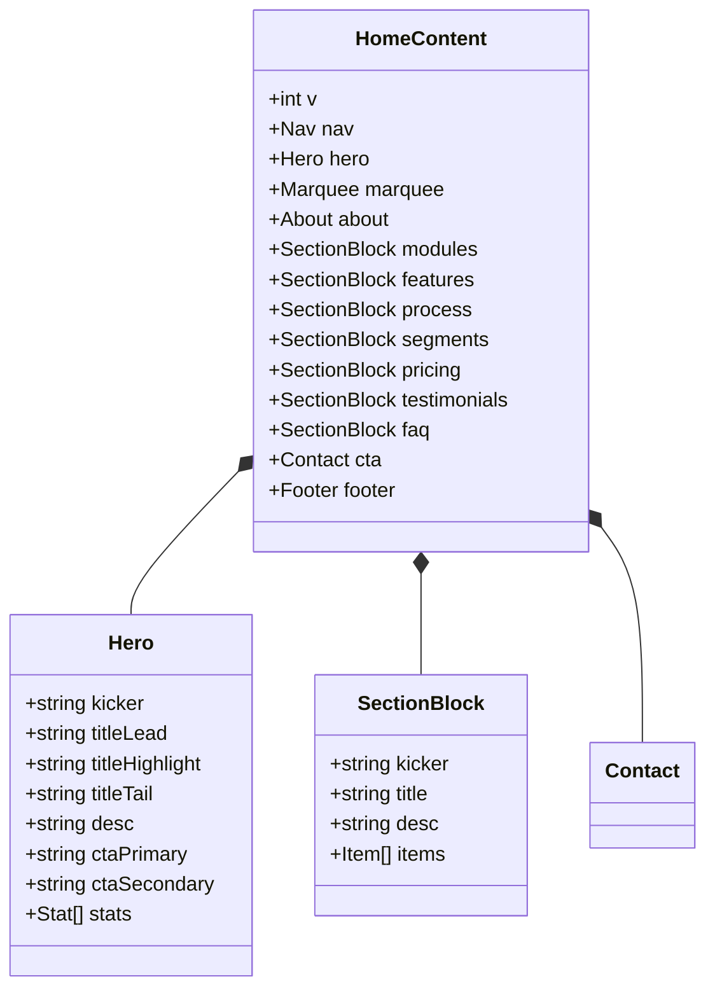
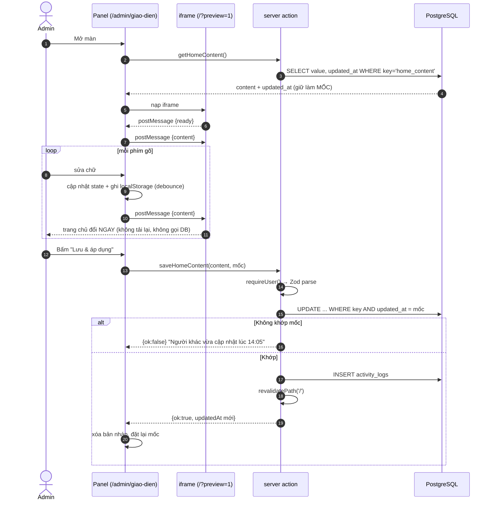
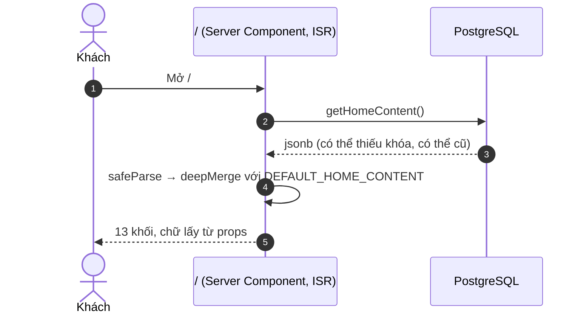

# Domain: Nội dung Trang chủ & Trình sửa trực tiếp (Home Content / Customizer)

> **Hệ thống:** website OAlpha — repo `novaix-website`. Một ứng dụng **Next.js 14 App Router** duy
> nhất. Xem [coding-style](../../conventions/coding-style.md) để biết ranh giới tầng.
>
> **Trạng thái:** 📝 thiết kế — chưa viết dòng code nào. Tài liệu này là **gốc**; PRD/RFC/Spec/Tasks
> nằm ở [`features/customizer/`](../features/customizer/).
>
> **Mã FR:** nhóm **C** (`FR-C01`…`FR-C13`).
>
> **Quan hệ với phân hệ Bài viết:** dùng chung màn `/admin/giao-dien` và chung bảng `site_settings`
> — xem §4.9.

---

# 1. Domain Overview (Tổng quan phân hệ)

## 1.1 Bài toán

**Toàn bộ chữ của trang chủ đang nằm trong mã nguồn, và phần lớn còn không nằm ở chỗ dễ tìm.**

Đo trên mã hiện tại:

| Chữ nằm ở | Ví dụ | Ai sửa được |
| :-- | :-- | :-- |
| `lib/data.ts` (8 mảng) | `stats`, `modules`, `features`, `steps`, `segments`, `testimonials`, `sectors`, `nav` | Lập trình viên |
| **Viết cứng trong component** | Tiêu đề Hero, toàn bộ `About` (sứ mệnh/tầm nhìn/timeline 4 mốc), 6 khối `SectionHead`, thông tin liên hệ + nhãn form trong `CTA`, `Pricing`, `FAQ`, `Footer` | Lập trình viên |

README của repo còn ghi *"`lib/data.ts` — toàn bộ nội dung tập trung tại đây, sửa text ở đây"*. Câu
đó **không còn đúng**: quá nửa số chữ hiển thị trên trang chủ nằm rải trong 13 file `.tsx`.

Hệ quả:

1. **Sửa một câu chữ = một lần deploy.** Sai chính tả, đổi số điện thoại, đổi một con số trong phần
   giới thiệu — tất cả đều phải: sửa mã → commit → build → deploy → chờ.
2. **Marketing không tự chủ được.** Người viết nội dung phải mô tả thay đổi cho lập trình viên, rồi
   chờ, rồi kiểm lại. Vòng lặp tính bằng ngày cho một việc đáng lẽ tính bằng phút.
3. **Không ai dám sửa vì không thấy trước kết quả.** Đổi một tiêu đề từ 6 chữ thành 14 chữ có làm vỡ
   bố cục không? Hiện chỉ biết sau khi deploy.
4. **Menu `/admin/giao-dien` đang hứa đúng việc này** và trả về màn `ComingSoon`.

## 1.2 Mục tiêu cốt lõi

- **Sửa chữ trang chủ ngay trên trình duyệt**, không cần lập trình viên, không cần deploy.
- **Thấy kết quả ngay trong lúc gõ** — không phải bấm "xem trước", không phải tải lại trang.
- **An toàn để thử**: có bản nháp, có hoàn tác, có nút đặt lại về mặc định. Người dùng phải dám
  nghịch.
- **Không đánh đổi trang chủ thật**: nội dung chưa bấm *Lưu & áp dụng* thì khách **không** thấy.

## 1.3 Hình dạng màn hình

```
┌─ Giao diện trang chủ ─────────────────────────────┬──────────────────────┐
│ [🖥 Desktop] [📱 Mobile]   Đã khôi phục bản nháp   │  NỘI DUNG            │
│                    Mặc định · Hoàn tác · LƯU      │  ▸ Thanh điều hướng  │
├───────────────────────────────────────────────────┤  ▾ Hero      [Đặt lại]│
│                                                   │    Kicker  [_______] │
│         TRANG CHỦ THẬT, ĐANG CHẠY                 │    Tiêu đề [_______] │
│         (iframe — cuộn được, bấm được)            │    Mô tả   [_______] │
│                                                   │  ▸ Về chúng tôi      │
│         Gõ bên phải → đổi ngay bên trái           │  ▸ Module            │
│                                                   │  ▸ Bảng giá          │
└───────────────────────────────────────────────────┴──────────────────────┘
```

Trái là **trang chủ thật**, không phải bản mô phỏng. Phải là panel sửa chữ, nhóm theo đúng thứ tự
các khối trên trang.

## 1.4 Stack & tích hợp

Phân hệ này **không thêm tầng mới, không thêm bảng mới, không thêm dependency mới**:

| Việc | Dùng gì |
| :-- | :-- |
| Lưu nội dung | `site_settings` (khóa `home_content`) — bảng đã khai ở [phân hệ Bài viết](./content-article-domain.md#52-entity-specifications) |
| Nghiệp vụ | Server Action `lib/site-content/actions.ts` |
| Kiểm quyền | `requireUser()` — dùng lại, không viết lớp thứ hai |
| Giao diện panel | **MUI 6** + `@tabler/icons-react` |
| Xem trước | **`<iframe>` + `postMessage`** — không thư viện |
| Nhật ký | `activity_logs` — đã khai ở phân hệ Bài viết |

---

# 2. Sub-systems & Feature Breakdown

| # | Nhóm tính năng | Mô tả | FR |
| :-- | :-- | :-- | :-- |
| 1 | **Lược đồ nội dung** | Một Zod schema mô tả toàn bộ chữ của trang chủ + bản mặc định rút từ mã hiện tại | FR-C12 |
| 2 | **Trang chủ đọc từ DB** | 13 component nhận chữ qua `props`, không viết cứng nữa | FR-C12 |
| 3 | **Khung xem trước** | iframe + `postMessage` hai chiều | FR-C01, FR-C02 |
| 4 | **Panel sửa chữ** | Nhóm theo khối, mở/gập, đếm ký tự | FR-C03, FR-C10 |
| 5 | **Sửa danh sách** | Thêm · xóa · sắp thứ tự các mục lặp (module, bước, câu hỏi…) | FR-C04 |
| 6 | **Desktop / Mobile** | Đổi bề rộng khung xem trước | FR-C05 |
| 7 | **Bản nháp & hoàn tác** | Tự lưu nháp, khôi phục, hoàn tác/làm lại, đặt lại | FR-C06, FR-C07, FR-C08 |
| 8 | **Lưu & áp dụng** | Ghi DB, làm mới cache, ghi nhật ký, chặn ghi đè | FR-C09, FR-C11, FR-C13 |

---

# 3. Ubiquitous Language (Ngôn ngữ thống nhất)

| Thuật ngữ | Tiếng Việt | Định nghĩa |
| :-- | :-- | :-- |
| **Home content** | Nội dung trang chủ | Toàn bộ **chữ** hiển thị trên `/`, lưu thành **một** đối tượng jsonb dưới khóa `home_content`. |
| **Section** | Khối | Một phần của trang chủ (Hero, Về chúng tôi, Module…). Đơn vị nhóm của panel bên phải và là mỏ neo cuộn trong khung xem trước. |
| **Field** | Trường | Một ô chữ sửa được (`hero.title`, `pricing.kicker`…). Có kiểu, có giới hạn độ dài, có bắt buộc hay không. |
| **List field** | Danh sách | Trường là **mảng** các mục cùng hình dạng (9 module, 5 bước, 6 câu hỏi). Thêm/xóa/sắp xếp được. |
| **Defaults** | Bản mặc định | Nội dung gốc rút từ mã nguồn hiện tại, nằm trong `lib/site-content/defaults.ts`. Nút *Mặc định* trả về đúng bản này. |
| **Draft** | Bản nháp | Nội dung đang sửa, **chưa** lưu. Sống trong bộ nhớ trình duyệt + `localStorage`. Khách **không** thấy. |
| **Published** | Bản đã áp dụng | Nội dung trong `site_settings`. Đây là thứ khách thấy. |
| **Preview frame** | Khung xem trước | `<iframe>` trỏ tới `/?preview=1`, nhận nội dung nháp qua `postMessage` và render lại. |
| **Live** | Trực tiếp | Gõ tới đâu khung xem trước đổi tới đó — **không** lưu, **không** tải lại trang, **không** gọi máy chủ. |

🔴 **"Nội dung trang chủ" KHÔNG phải "bài viết".** Bài viết ([phân hệ B](./content-article-domain.md))
có slug, đọc tuần tự, chia sẻ được bằng link. Nội dung trang chủ là **chữ gắn với bố cục** — một
nhãn nút, một dòng mô tả trong thẻ ba cột. Hai thứ khác nhau về hình dạng dữ liệu, khác nhau về
người dùng, và **không được nhét chung một bảng**.

---

# 4. Architecture Design & Core Decisions

## 4.1 🔴 Quyết định lớn nhất: xem trước bằng **iframe**, không phải dựng lại giao diện trong panel

Có hai cách làm khung bên trái. Chọn sai là hỏng cả tính năng.

| PA | Cách | Đánh đổi |
| :-- | :-- | :-- |
| **A** ⭐ | **`<iframe src="/?preview=1">`** — nhúng chính trang chủ thật | Cái nhìn thấy **là** cái khách sẽ thấy. CSS cách ly hoàn toàn. Đổi Desktop/Mobile chỉ là đổi bề rộng iframe. Trả giá: phải làm cầu `postMessage`. |
| **B** | Render lại các component trang chủ **ngay trong** trang admin | Không cần cầu nối. Nhưng: **hai hệ giao diện đè nhau** — admin là MUI nền sáng `#F2F6FA`, trang chủ là Tailwind nền tối `#070b16` với `body::before` là các quầng sáng `position: fixed` phủ toàn màn. Nhúng thẳng vào nhau là hai bộ nền tranh chỗ. Và bề rộng khung admin ≠ bề rộng màn khách, nên mọi `clamp()`, mọi breakpoint đều hiện **sai**. |

**Chọn A.** Lý do quyết định không phải kỹ thuật mà là niềm tin: nếu khung xem trước hiện khác trang
thật dù chỉ một chỗ, người dùng sẽ ngừng tin nó và quay lại thói quen "sửa xong deploy rồi mở web ra
xem" — tức là tính năng tồn tại mà không ai dùng.

Đây cũng là lý do khung xem trước phải **cuộn được và bấm được như trang thật**, không phải một ảnh
chụp tĩnh.

## 4.2 Luồng "live" — một chiều dữ liệu, hai chiều sự kiện

```text
Panel (cha)                                   iframe (con) — /?preview=1
   │  người dùng gõ                                │
   ├─ postMessage({type:'content', data}) ────────►│  setState(data) → React render lại
   │                                               │
   │◄──────── postMessage({type:'ready'}) ─────────┤  báo đã sẵn sàng nhận
   │◄──────── postMessage({type:'section-click'}) ─┤  người dùng bấm vào một khối
   │  → panel tự mở đúng nhóm                      │
   ├─ postMessage({type:'scroll-to', section}) ───►│  cuộn tới khối đang sửa
```

Bốn luật:

1. **Không lưu gì khi gõ.** Live nghĩa là đổi **hình ảnh trên màn**, không phải ghi database. Mỗi
   phím gõ mà đi một lượt xuống DB là vừa chậm, vừa biến mọi lần thử thành một lần sửa thật.
2. **Không tải lại iframe.** Đổi `src` hay gọi `reload()` mỗi lần gõ là nhấp nháy trắng màn hình và
   mất vị trí cuộn — người dùng đang sửa chân trang bị ném ngược lên đầu trang.
3. 🔴 **Kiểm `event.origin` ở CẢ hai đầu.** Iframe nhận nội dung rồi render nó ra trang. Nhận không
   kiểm nguồn nghĩa là bất kỳ trang nào nhúng được `/?preview=1` cũng bơm được chữ tùy ý vào — và
   ảnh chụp màn hình kết quả trông y như trang thật của OAlpha. Đây là kênh dựng nội dung giả mạo,
   không phải lỗ XSS, nhưng hậu quả thực tế nặng ngang.
4. **Chữ chỉ là chữ.** Nội dung được render bằng `{text}` của React (tự thoát HTML), **không bao giờ**
   `dangerouslySetInnerHTML`. Nhờ vậy phân hệ này không cần bộ làm sạch HTML nào.

## 4.3 Trang xem trước không được lọt ra ngoài

`/?preview=1` là **cùng một trang chủ**, chỉ khác nguồn nội dung. Ba hàng rào:

| Hàng rào | Vì sao |
| :-- | :-- |
| `robots: noindex, nofollow` khi có `?preview=1` | Google lập chỉ mục bản xem trước là hai URL cùng nội dung, và một trong hai hiện chữ chưa duyệt |
| **Không cache** (`no-store`) ở nhánh preview | Bản xem trước lọt vào cache là khách thật nhận nội dung nháp |
| Preview **không tự lấy dữ liệu nháp từ đâu cả** | Nó khởi tạo bằng **bản đã áp dụng** rồi chờ `postMessage`. Mở thẳng `/?preview=1` bằng tay chỉ thấy đúng trang chủ hiện tại — không có gì để rò |

Luật 3 quan trọng nhất: bản nháp **không tồn tại ở phía máy chủ**, nên không có đường nào để lộ nó.

## 4.4 Nội dung là MỘT đối tượng, không phải mỗi khối một dòng

Toàn bộ chữ trang chủ nằm trong **một** hàng `site_settings` khóa `home_content`.

| PA | Đánh đổi |
| :-- | :-- |
| **Một đối tượng** ⭐ | Đọc trang chủ = **1 truy vấn**. Lưu = 1 lần ghi, nguyên tử — không có trạng thái "Hero đã lưu, Bảng giá chưa". Hoàn tác đơn giản vì có một cây trạng thái duy nhất. |
| Mỗi khối một hàng | Ghi từng phần được, nhưng đọc trang chủ thành 13 truy vấn, và lưu nửa chừng lỗi là trang chủ pha trộn hai phiên bản |

Kích thước không phải vấn đề: toàn bộ chữ trang chủ ước ~25–40 KB JSON, nhỏ hơn một tấm ảnh bìa.

## 4.5 🔴 Mặc định nằm trong MÃ, dữ liệu chỉ là lớp đè lên

```text
Nội dung hiển thị = deepMerge( DEFAULT_HOME_CONTENT , site_settings.home_content )
                     (trong mã, luôn đủ)        (trong DB, có thể thiếu/cũ)
```

Đây là quyết định chống lại kiểu hỏng nguy hiểm nhất của mọi hệ CMS tự xây: **lập trình viên thêm một
khối mới vào trang chủ, DB chưa có khóa đó, trang chủ vỡ** — hoặc tệ hơn, hiện một mảng trống trơn
không lỗi không cảnh báo.

Bốn hệ quả bắt buộc:

1. **Đọc phải `safeParse` + merge sâu.** Hỏng schema → dùng nguyên bản mặc định, ghi `console.warn`,
   **trang chủ không được vỡ**.
2. **Thêm trường mới vào schema là an toàn**: trang chủ lấy giá trị mặc định cho tới khi có người sửa.
3. **Xóa trường khỏi schema thì dữ liệu thừa trong DB bị bỏ qua**, không cần migration.
4. 🔴 **Sau đợt này, sửa chữ trong `defaults.ts` KHÔNG còn đổi được trang chủ đang chạy** — vì bản
   trong DB đè lên. Đây là chỗ dev sẽ mất nửa buổi nếu không ai nói trước. Phải ghi comment ngay đầu
   file `defaults.ts`.

## 4.6 Bản nháp sống ở trình duyệt, không ở máy chủ

Bản nháp lưu trong `localStorage` theo khóa `home_content_draft`, tự ghi lại sau mỗi lần gõ (debounce).
Mở lại màn hình thấy bản nháp cũ → hiện dòng *"Đã khôi phục bản nháp chưa lưu"* kèm nút bỏ bản nháp.

Vì sao không lưu nháp xuống DB:

- Nháp ở máy chủ đẻ ra câu hỏi "nháp của ai" — hai người sửa cùng lúc thì nháp của ai đè nháp của ai.
  Với một đội vài người, chi phí đó không xứng.
- Nháp ở máy chủ cần một đường ghi thứ hai, và đường ghi nào cũng là một bề mặt phải kiểm quyền.
- Đổi lại, nháp **không đi theo người dùng sang máy khác**. Chấp nhận, và **nói rõ trên giao diện** —
  đừng để người ta tưởng mình đã lưu.

🔴 Bản nháp trong `localStorage` phải kèm **dấu thời gian của bản đã áp dụng lúc nó được tạo**. Nếu
người khác đã lưu bản mới hơn, khôi phục nháp cũ đè lên là **âm thầm quay ngược** công của người
khác — xem §4.7.

## 4.7 Chống ghi đè giữa hai người

Không khóa, không hàng đợi — chỉ một phép so sánh:

```text
Lúc mở màn:  đọc content + updated_at  →  giữ lại updated_at làm "mốc"
Lúc bấm Lưu: gửi kèm mốc đó
             DB.updated_at khác mốc?  →  KHÔNG ghi, báo:
             "Người khác vừa cập nhật nội dung lúc 14:05. Tải lại để xem bản mới nhất."
```

Ghi đè im lặng là kiểu mất dữ liệu tệ nhất: không ai biết nó đã xảy ra, và người bị mất chỉ phát
hiện khi tình cờ mở lại trang chủ vài hôm sau.

## 4.8 Chỉ sửa CHỮ — không sửa màu, bố cục, ảnh

Phạm vi đợt này **chỉ là chữ** (kể cả emoji, vì emoji trong `lib/data.ts` là ký tự chữ). Không đổi
màu, không đổi phông, không kéo thả đổi thứ tự khối, không đổi ảnh.

Vì sao vạch ở đây:

- Chữ là thứ đổi **hằng tuần**; màu và bố cục đổi vài lần một năm và thường đi kèm quyết định thương
  hiệu — không phải việc làm nhanh giữa hai cuộc họp.
- Mở cho sửa màu là mở luôn khả năng tạo ra một trang chủ **không đọc được** (chữ trắng trên nền
  trắng) mà không có gì ngăn lại.
- Đổi thứ tự khối chạm vào `app/page.tsx`, tức là chạm vào bố cục — một bài toán khác hẳn, và nó cần
  bản xem trước có kéo thả.

Cấu trúc dữ liệu **không chặn đường mở rộng**: thêm nhóm `theme` vào cùng đối tượng `home_content` là
việc của một đợt sau.

## 4.9 Quan hệ với phân hệ Bài viết

Hai phân hệ **dùng chung một màn và một bảng**, phải nói rõ để không ai dựng bản thứ hai:

| Dùng chung | Cách chia |
| :-- | :-- |
| Màn `/admin/giao-dien` | **Tab**: *Nội dung trang chủ* (nhóm C) · *Dải bài viết* (FR-B07). Cùng một khung xem trước bên trái |
| Bảng `site_settings` | Hai khóa khác nhau: `home_content` (C) · `home_article_rails` (B) |
| `activity_logs` | Hành động `settings.home_content.update` · `settings.rails.update` |
| `requireUser()` | Cùng phép kiểm, cùng vai trò `admin` trở lên |

🔴 **Sửa lại ranh giới đã ghi ở phân hệ Bài viết.** [Content-Article §4.8](./content-article-domain.md#48-ranh-giới-với-libdatats)
viết *"`stats`, `modules`, `features`, `steps`, `segments`, `nav` **ở nguyên** trong `lib/data.ts`"*.
Sau đợt này, chúng **rời khỏi `lib/data.ts` sang `site_settings.home_content`** — nhưng ranh giới
**gốc vẫn đúng và không đổi**: chúng vẫn **không phải bài viết**, không có slug, không vào bảng
`articles`. Phần cần sửa là *"nằm ở đâu"*, không phải *"là loại gì"*.

## 4.10 Ảnh hưởng tới phần khác của hệ thống

| Phần | Ảnh hưởng |
| :-- | :-- |
| 13 component `components/*.tsx` | 🔴 **Đổi chữ ký**: nhận nội dung qua `props`, bỏ hết chuỗi viết cứng. Đây là phần việc lớn nhất |
| `lib/data.ts` | Chuyển thành `lib/site-content/defaults.ts`; README phải sửa theo |
| `app/page.tsx` | Đọc nội dung, truyền xuống các khối; bọc thêm cầu xem trước |
| `lib/admin/menu.ts` | Gỡ `comingSoon` khỏi *Giao diện trang chủ* |
| `site_settings` | Thêm khóa `home_content` — **không** thêm bảng |
| README | Câu *"toàn bộ nội dung tập trung ở `lib/data.ts`"* **không còn đúng**, phải viết lại |

---

# 5. Domain Model

## 5.1 Không có thực thể mới

Phân hệ này **không tạo bảng nào**. Nó thêm một khóa vào `site_settings`:

| Khóa | Giá trị | Ai ghi |
| :-- | :-- | :-- |
| `home_content` | Đối tượng jsonb đúng `homeContentSchema` | Nhóm C |
| `home_article_rails` | *(đã có)* cấu hình hai dải bài viết | Nhóm B |

## 5.2 Hình dạng `home_content`



`v` là **số phiên bản lược đồ**. Nó tồn tại để ngày nào hình dạng đổi lớn thì còn biết dữ liệu trong
DB đang theo bản nào — không có nó thì việc duy nhất làm được là đoán.

## 5.3 Bản kê khối & trường

Đếm trên mã hiện tại — con số này là **phạm vi thật** của việc bóc chữ:

| # | Khối | Nguồn chữ hiện tại | Trường đơn | Danh sách |
| :-- | :-- | :-- | :-- | :-- |
| 1 | **Thanh điều hướng** | `lib/data.ts: nav` + `Navbar.tsx` | tên thương hiệu | 5 mục menu, nhãn nút CTA |
| 2 | **Hero** | ❗ viết cứng trong `Hero.tsx` | kicker, 3 mảnh tiêu đề, mô tả, 2 nút | — |
| 3 | **Số liệu** | `lib/data.ts: stats` | — | 4 mục (số, hậu tố, nhãn) |
| 4 | **Dải lĩnh vực** | `lib/data.ts: sectors` | — | 8 nhãn |
| 5 | **Về chúng tôi** | ❗ viết cứng trong `About.tsx` | kicker, tiêu đề, mô tả | 3 giá trị cốt lõi, **4 mốc timeline** |
| 6 | **Module** | `SectionHead` cứng + `data.ts: modules` | kicker, tiêu đề, mô tả | 9 module (icon, tên, mô tả, nhãn) |
| 7 | **Vì sao chọn** | `data.ts: features` | kicker, tiêu đề, mô tả | 4 mục |
| 8 | **Quy trình** | `SectionHead` cứng + `data.ts: steps` | kicker, tiêu đề, mô tả | 5 bước |
| 9 | **Đối tượng** | `SectionHead` cứng + `data.ts: segments` | kicker, tiêu đề, mô tả | 3 nhóm, mỗi nhóm 3 gạch đầu dòng |
| 10 | **Bảng giá** | ❗ viết cứng trong `Pricing.tsx` | kicker, tiêu đề, mô tả | các gói + tính năng từng gói |
| 11 | **Cảm nhận** | `SectionHead` cứng + `data.ts: testimonials` | kicker, tiêu đề, mô tả | 3 lời chứng |
| 12 | **Câu hỏi** | ❗ viết cứng trong `FAQ.tsx` | kicker, tiêu đề, mô tả | các cặp hỏi–đáp |
| 13 | **Liên hệ + Chân trang** | ❗ viết cứng trong `CTA.tsx`, `Footer.tsx` | kicker, tiêu đề, mô tả, 4 dòng liên hệ, 3 cam kết, nhãn form, thông điệp gửi thành công | tùy chọn của 2 ô chọn trong form |

**Ước lượng: ~130 trường chữ**, trong đó **quá nửa đang viết cứng trong component** chứ không ở
`lib/data.ts`. Con số này là lý do task bóc chữ (T2) phải tách riêng và làm trước.

---

# 6. Core Workflows

## 6.1 Sửa một dòng chữ và áp dụng



## 6.2 Khách mở trang chủ



Không có nhánh nào để khách nhận nội dung nháp: bản nháp chỉ tồn tại trong trình duyệt của người
đang sửa.

---

# 7. Business Rules

**Hiển thị**

- **R1.** Khách chỉ thấy **bản đã áp dụng**. Nội dung chưa bấm *Lưu & áp dụng* không ra khỏi máy của
  người đang sửa.
- **R2.** Nội dung hiển thị = **mặc định trong mã** bị đè bởi **bản trong DB** (§4.5). Thiếu khóa
  nào thì lấy mặc định của khóa đó, không phải bỏ trống.
- **R3.** Dữ liệu trong DB không hợp lược đồ → **dùng nguyên bản mặc định** + ghi cảnh báo. Trang chủ
  **không bao giờ** được vỡ vì một dòng jsonb cũ.

**Toàn vẹn nội dung**

- **R4.** Trường **bắt buộc không được rỗng**. Tiêu đề rỗng không phải "ẩn tiêu đề" mà là một khoảng
  trắng vô nghĩa giữa trang.
- **R5.** Trường **tùy chọn** để rỗng → phần tử tương ứng **không render** (không phải render rỗng).
- **R6.** Danh sách có **số mục tối thiểu và tối đa**. Lưới 9 module còn 1 mục là bố cục hỏng, còn 40
  mục là trang chủ thành catalog.
- **R7.** Chữ là **chữ thuần**. Không nhận HTML, không render bằng `dangerouslySetInnerHTML`. Muốn
  xuống dòng thì dùng đúng một trường riêng, không phải nhét `<br>`.

**Sửa & lưu**

- **R8.** Gõ **không** lưu. Chỉ *Lưu & áp dụng* mới ghi DB.
- **R9.** *Mặc định* trả về đúng bản trong mã — cho **một nhóm** hoặc **toàn bộ**, và vẫn phải bấm
  *Lưu & áp dụng* mới có hiệu lực. Nút đặt lại mà tự lưu luôn là một cách rất nhanh để xóa sạch công
  của người khác bằng một cú bấm nhầm.
- **R10.** *Hoàn tác* chỉ sống trong phiên làm việc. Đóng tab là hết — và giao diện phải nói vậy.
- **R11.** Lưu khi bản trong DB đã đổi so với lúc mở màn → **từ chối**, báo rõ ai và lúc nào (§4.7).
- **R12.** Mọi lần *Lưu & áp dụng* ghi `activity_logs`. 🔴 `meta` ghi **tên các khối đã đổi**, không
  ghi toàn bộ nội dung — nhật ký không phải chỗ sao lưu.

**Phân quyền**

- **R13.** `admin` và `super_admin` đều sửa được — đây là *nội dung*, đúng việc của vai trò `admin`.
- **R14.** Vai trò đọc từ **database** qua `requireUser()`, không tin token.
- **R15.** Trang xem trước **không có đặc quyền gì**: nó chỉ render thứ cửa sổ cha gửi sang, và chỉ
  nhận từ đúng `origin` của chính site (§4.2).

---

# 8. Draft API Requirements

> 🔴 Không có REST API. Đây là **chữ ký hàm** — chi tiết ở [RFC §8](../features/customizer/customizer-rfc.md).

| Hàm | Ở đâu | Việc |
| :-- | :-- | :-- |
| `getHomeContent()` | `lib/site-content/queries.ts` | Đọc + `safeParse` + merge mặc định. Dùng cho **cả** trang chủ lẫn panel |
| `getHomeContentForEdit()` | `lib/site-content/actions.ts` | Như trên, kèm `updatedAt` làm mốc chống ghi đè |
| `saveHomeContent(input)` | " | Kiểm quyền → Zod → so mốc → ghi → nhật ký → `revalidatePath('/')` |

**Giao thức `postMessage`** (hợp đồng giữa panel và khung xem trước — đổi một bên phải đổi bên kia):

| Hướng | Thông điệp | Nghĩa |
| :-- | :-- | :-- |
| con → cha | `{ type: 'preview:ready' }` | Iframe đã gắn xong bộ nghe, cha có thể gửi nội dung |
| cha → con | `{ type: 'preview:content', content }` | Nội dung mới, render lại |
| cha → con | `{ type: 'preview:scroll-to', section }` | Cuộn tới khối đang sửa |
| con → cha | `{ type: 'preview:section-click', section }` | Người dùng bấm vào một khối → panel mở đúng nhóm |

---

# 9. Product Recommendations & Future Improvements

Ghi lại để **không làm bây giờ**:

1. **Sửa màu / phông** — thêm nhóm `theme` vào cùng `home_content`. Cần một bộ kiểm tương phản, nếu
   không sẽ có người tạo ra chữ trắng trên nền trắng.
2. **Kéo thả đổi thứ tự khối** — chạm vào `app/page.tsx`, là bài toán bố cục chứ không phải nội dung.
3. **Đổi ảnh** (logo, ảnh nền) — dùng lại `BlobStorage` của phân hệ Bài viết.
4. **Lịch sử phiên bản + khôi phục bản cũ** — cần bảng `site_settings_history`. Hiện chỉ có hoàn tác
   trong phiên.
5. **Xem trước bằng link chia sẻ** cho người duyệt nội dung không có tài khoản. Cần nháp ở máy chủ,
   tức là bỏ §4.6.
6. **Đa ngôn ngữ** — nhân đôi cây nội dung theo mã ngôn ngữ.
7. **Sửa chữ cho các trang khác** (`/bai-viet`, trang đọc). Cùng cơ chế, khác khóa.

---

## 4.11 Khối Đối tác & Khách hàng (Partners)

Một khối nội dung của trang chủ, **không phải phân hệ riêng**: lưu trong cùng `site_settings.home_content`
dưới khóa `partners`, sửa trong cùng màn `/admin/giao-dien`, dùng chung xem trước và nháp.

| | |
| :-- | :-- |
| **Mã FR** | `FR-P01`…`FR-P12` (nhóm **P**) |
| **Dữ liệu** | Khối `partners` trong jsonb — không thêm bảng |
| **Nội dung một mục** | Tên · logo (R2) · liên kết · công tắc hiển thị |
| **Cấu hình dải** | Tốc độ · khoảng cách · hướng · dừng khi rê chuột · chiều cao logo · lọc xám · màu nền. Vị trí trên trang dùng nút sắp xếp khối chung |
| **Thứ mới duy nhất** | Kiểu trường `image` cho panel — dùng lại được cho ảnh Hero, ảnh About sau này |
| **Trạng thái** | ✅ đã triển khai (18/08/2026) |

Chi tiết: [PRD](../features/partners/partners-prd.md) · [RFC](../features/partners/partners-rfc.md)
· [Spec](../features/partners/partners-spec.md) · [Tasks](../features/partners/partners-tasks.md)


# Output Rule

Tài liệu này là **gốc nghiệp vụ**. Không chứa mã, không chứa cấu hình môi trường, không chứa chi tiết
CSS/component. Từ đây phân rã ra:

- [PRD](../features/customizer/customizer-prd.md) — cái gì & tại sao
- [RFC](../features/customizer/customizer-rfc.md) — xây thế nào
- [Spec](../features/customizer/customizer-spec.md) — hành vi chi tiết
- [Tasks](../features/customizer/customizer-tasks.md) — chia việc

Khối **Đối tác** có bộ tài liệu riêng ở [`features/partners/`](../features/partners/).

# End
