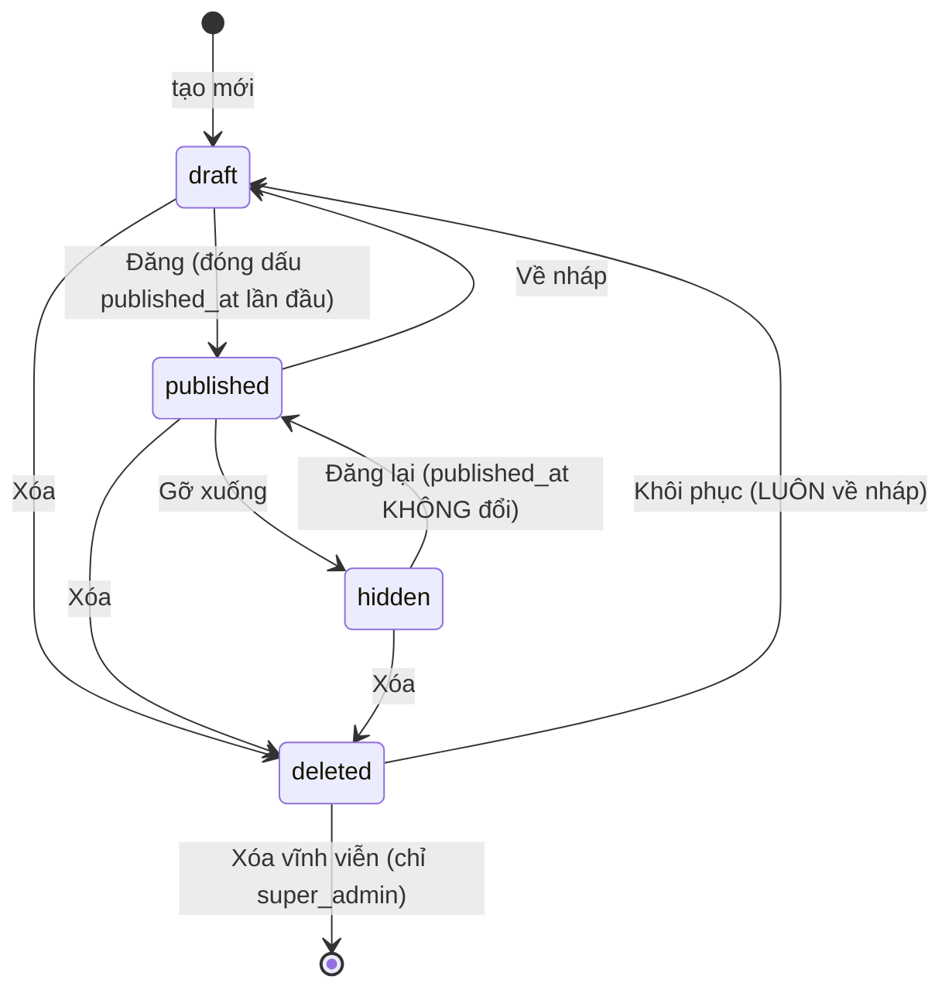

# Feature Spec — Bài viết & Trưng bày nội dung trên website OAlpha

> **PRD:** [`blog-prd.md`](./blog-prd.md) · **RFC:** [`blog-rfc.md`](./blog-rfc.md) ·
> **Domain:** [`content-article-domain.md`](../../domains/content-article-domain.md)
>
> Tài liệu này mô tả **hành vi nhìn thấy được**: từng màn, từng trạng thái, từng ca biên.

---

# 1. Tổng quan tính năng

| Mã màn | Đường dẫn | Ai vào được | Việc |
| :-- | :-- | :-- | :-- |
| **AD-B1** | `/admin/bai-viet` | `admin` ⬆ | Danh sách bài + tab danh mục + thùng rác |
| **AD-B2** | `/admin/bai-viet/moi` · `/admin/bai-viet/[id]` | `admin` ⬆ | Soạn thảo + khối Soi SEO |
| **AD-B3** | `/admin/giao-dien` → tab *Dải bài viết* | `admin` ⬆ | Cấu hình hai dải trang chủ |
| **SH-B1** | `/bai-viet` | Mọi người | Danh sách bài + lọc danh mục + phân trang |
| **SH-B2** | `/bai-viet/[slug]` | Mọi người | Trang đọc |
| **SH-B3** | `/` (trang chủ) | Mọi người | Hai dải bài viết |

---

# 2. User Stories

| # | Là | Tôi muốn | Để |
| :-- | :-- | :-- | :-- |
| US-1 | Admin | Soạn và đăng bài không cần lập trình viên | Nội dung ra kịp lúc cần |
| US-2 | Admin | Lưu nháp rồi đăng sau | Viết dở vẫn giữ được |
| US-3 | Admin | Biết bài mình viết còn thiếu gì về SEO | Bài tìm được trên Google mà tôi không phải học SEO |
| US-4 | Admin | Xóa nhầm thì lấy lại được | Không mất công viết lại |
| US-5 | Admin | Chọn bài nào lên trang chủ | Đẩy nội dung đang cần đẩy |
| US-6 | Sale | Có link để gửi khách | Không phải gõ lại cùng một đoạn mỗi ngày |
| US-7 | Khách | Đọc bài dài mà không lạc | Tìm đúng đoạn tôi cần |
| US-8 | Khách | Gửi link tới đúng một đoạn | Trao đổi với đồng nghiệp |

---

# 3. Hành vi chi tiết

## 3.1 AD-B1 — Quản lý bài viết

Hai tab trong cùng một màn: **Bài viết** · **Danh mục**. Khuôn giao diện dùng `PageHeader` +
`Card` của MUI, giống hệt màn *Quản lý thành viên* đang có — không chế kiểu bố cục thứ hai.

### Tab *Bài viết*

**Thanh lọc** (một hàng, xuống dòng trên màn hẹp):

| Ô | Kiểu | Mặc định |
| :-- | :-- | :-- |
| Từ khóa | `TextField` (tìm trong tiêu đề + mô tả ngắn) | rỗng |
| Danh mục | `Select` | Tất cả |
| Trạng thái | `Select`: Tất cả · Nháp · Đã đăng · Ẩn · **Thùng rác** | Tất cả (không gồm thùng rác) |
| Khoảng ngày | 2 ô ngày (theo `published_at`, thiếu thì `created_at`) | rỗng |

🔴 **Thùng rác là một lựa chọn trong ô Trạng thái**, không phải một tab thứ ba. Bài đã xóa **không
bao giờ** lọt vào các bộ lọc khác — kể cả "Tất cả". "Tất cả" nghĩa là *mọi bài còn sống*.

**Bảng:**

| Cột | Nội dung | Sắp xếp |
| :-- | :-- | :-- |
| Ảnh bìa | Ô vuông 48px, thiếu ảnh thì hiện khối xám có icon | — |
| Tiêu đề | Chữ đậm + slug xám nhỏ bên dưới | ✅ |
| Danh mục | `Chip` | — |
| Trạng thái | `Chip` — Nháp (xám) · Đã đăng (xanh) · Ẩn (cam) | — |
| Ngày đăng | `dd/MM/yyyy HH:mm` theo `Intl` vi-VN; chưa đăng thì `—` | ✅ |
| Người soạn | Tên; tài khoản đã xóa thì hiện *"(đã xóa)"* | — |
| Thao tác | Sửa · Xem trên web · Đăng/Ẩn · Xóa | — |

- **"Xem trên web"** chỉ hiện với bài `published`; mở tab mới tới `/bai-viet/<slug>`.
- Phân trang **20 dòng/trang**.
- Bảng **không** lấy `content_html` (RFC §12).

**Trạng thái rỗng** phải phân biệt ba tình huống — cùng một chữ "Không có dữ liệu" cho cả ba là lười
và làm người dùng tưởng hỏng:

| Tình huống | Hiện gì |
| :-- | :-- |
| Chưa có bài nào | *"Chưa có bài viết nào. Bấm **Thêm bài viết** để bắt đầu."* + nút |
| Có bài nhưng bộ lọc không ra gì | *"Không có bài viết khớp bộ lọc."* + nút **Xóa bộ lọc** |
| Thùng rác trống | *"Thùng rác trống."* |

### Tab *Danh mục*

Bảng: Tên · Slug · Số bài · Hiện/Ẩn (`Switch`) · Thứ tự (nút ▲▼) · Thao tác.

- **Xóa danh mục còn bài → chặn**, hiện đúng số bài đang vướng:
  > *"Danh mục này còn 7 bài viết. Chuyển các bài sang danh mục khác trước khi xóa."*
- Tắt `visible` → hiện cảnh báo ngay dưới hàng: *"Ẩn danh mục sẽ ẩn cả 7 bài trong đó khỏi website."*
  Nói trước, không để người dùng phát hiện bằng cách mở website lên xem.
- Slug tự sinh từ tên, sửa được. Trùng → báo tại ô.

## 3.2 AD-B2 — Màn soạn thảo

**Bố cục desktop (≥1200px):**

```
┌──────────────────────────────────────────────────────────────┐
│ ‹ Quay lại   [Nháp]        Xem trước · Lưu · Đăng            │  thanh dính đỉnh
├───────────────────────────────────┬──────────────────────────┤
│ Tiêu đề                           │  ẢNH BÌA                 │
│ Đường dẫn: /bai-viet/[slug]  Sửa  │  [khối tải ảnh]          │
│                                   │  DANH MỤC   [Select]     │
│ ┌───────────────────────────────┐ │  MÔ TẢ NGẮN [textarea]   │
│ │  Thanh công cụ soạn thảo      │ │    128/160               │
│ ├───────────────────────────────┤ │ ─────────────────────────│
│ │                               │ │  SOI SEO                 │
│ │  Vùng soạn nội dung           │ │  Từ khóa chính [____]    │
│ │                               │ │  ▓▓▓▓▓▓▓░░░ 72%          │
│ │                               │ │  • 3 gợi ý nên sửa       │
│ │                               │ │  • 2 gợi ý có thể tốt hơn│
│ └───────────────────────────────┘ │  [⚙ Ngưỡng]              │
└───────────────────────────────────┴──────────────────────────┘
```

Dưới 1200px: cột phải xuống dưới vùng soạn thảo, khối Soi SEO thu lại thành một `Accordion`.

**Thanh trên cùng dính (`position: sticky`)** — bài dài 3.000 từ mà nút Lưu nằm tận cuối trang là bắt
người ta cuộn hai nghìn pixel để lưu.

**Ba nút, ba việc khác nhau:**

| Nút | Việc | Sau đó |
| :-- | :-- | :-- |
| **Lưu** | Ghi, giữ nguyên trạng thái | Toast *"Đã lưu"*, ở lại màn |
| **Xem trước** | Lưu rồi mở `/bai-viet/<slug>` ở tab mới | Bài `draft` xem trước được **chỉ khi đã đăng nhập** — xem §6 |
| **Đăng** | Lưu + chuyển `published` | Toast + nút đổi thành **Gỡ xuống** |

**Cảnh báo rời trang khi chưa lưu** (`beforeunload`). Mất một bài 2.000 chữ vì lỡ bấm Back là loại
mất mát không có cách nào cứu.

### Slug — hành vi

| Tình huống | Hành vi |
| :-- | :-- |
| Bài mới, đang gõ tiêu đề | Slug **tự sinh theo tiêu đề**, hiện mờ dưới ô tiêu đề |
| Người dùng bấm *Sửa* slug | Ngắt tự sinh **vĩnh viễn** cho bài đó — người ta đã có ý riêng |
| Bài **đã đăng**, đổi tiêu đề | 🔴 Slug **KHÔNG tự đổi**. Link đã gửi đi phải còn sống |
| Bài **đã đăng**, cố ý đổi slug | Hộp thoại: *"Đường dẫn cũ `/bai-viet/abc` sẽ không còn dùng được. Link đã gửi cho khách sẽ báo lỗi 404. Vẫn đổi?"* |
| Slug trùng | Báo đỏ tại ô: *"Đường dẫn này đã được dùng cho bài khác."* Không tự thêm `-2` — im lặng đổi thứ người ta vừa gõ là tệ hơn |

### Sau khi lưu — cảnh báo thẻ bị loại

Nếu bộ làm sạch loại bỏ thứ gì, hiện `Alert` màu cam **liệt kê cụ thể**:

> *"Đã loại bỏ khỏi nội dung: `script`, `iframe`, thuộc tính `style`. Nội dung dán từ Word hoặc web
> khác thường mang theo các thẻ này."*

🔴 Im lặng bỏ thẻ là kiểu hỏng đúng bằng im lặng nuốt ảnh: người soạn dán một khối nhúng video, bấm
lưu, thấy "Đã lưu", và chỉ phát hiện video biến mất khi khách hỏi.

### Chèn ảnh

- Kéo–thả hoặc bấm nút trên thanh công cụ.
- Trong lúc tải: chèn ô giữ chỗ có vòng quay, **khóa nút Lưu**.
- Xong: thay bằng `` thật, con trỏ nhảy xuống dòng dưới.
- Lỗi: gỡ ô giữ chỗ, toast đỏ nói rõ lý do (*quá 5 MB* · *chỉ nhận JPEG/PNG/WEBP* · *không kết nối
  được kho ảnh*). 🔴 **Không mất nội dung đang soạn** vì một ảnh hỏng.
- Ảnh vừa chèn có `alt` rỗng → khối Soi SEO nhắc ngay ở lượt chấm kế tiếp.

## 3.3 Khối Soi SEO (FR-B05)

**Chạy hoàn toàn trong trình duyệt, debounce 300ms, không gọi máy chủ.**

**Đầu khối:**

- Ô **Từ khóa chính** (một cụm, ví dụ *"triển khai ERP"*). Chưa nhập → các luật từ khóa **vẫn hiện**
  ở mức *"có thể tốt hơn"* kèm lời mời nhập. 🔴 Ẩn chúng đi là để người soạn tưởng bài đã ổn trong
  khi phần quan trọng nhất chưa được đo lần nào.
- Thanh **Mức sẵn sàng** 0–100%, màu trung tính (xanh dương của theme), **không** đỏ, **không** hiện
  con số to. Chú thích dưới thanh: *"Đo phần gợi ý đã theo được — không phải điểm chất lượng bài
  viết."*

**Danh sách gợi ý**, nhóm theo mức, mỗi mục ba dòng:

```
● Tiêu đề dài 78 ký tự
  Google thường cắt tiêu đề quanh 60 ký tự trên trang kết quả.
  → Rút còn dưới 60 ký tự, giữ từ khóa ở đầu.
```

| Mức | Chấm màu | Nghĩa |
| :-- | :-- | :-- |
| `should-fix` | Cam | Nên sửa trước khi đăng |
| `could-be-better` | Xám | Tốt hơn nếu sửa |
| `ok` | Xanh | Đã đạt — gộp vào một dòng *"5 mục đã đạt"*, bấm mới mở ra |

🔴 **Ba điều tuyệt đối không làm:**

1. **Không chặn** nút Lưu hay Đăng, trong mọi trường hợp.
2. **Không** hiện điểm số lớn kèm màu đỏ.
3. **Không** tự sửa bài — mỗi gợi ý chỉ nói *sửa thế nào*, người viết là người quyết định.

**Nút ⚙ Ngưỡng** mở hộp thoại chỉnh: số từ tối thiểu, độ dài tiêu đề/mô tả, mật độ từ khóa tối đa,
và **danh sách luật bật/tắt**. Ngưỡng lưu ở `localStorage` theo id bài.

🔴 Tắt một luật thì luật đó rời khỏi **cả tử số lẫn mẫu số** của Mức sẵn sàng. Thanh **không được
tụt** khi người dùng tắt một luật đang đỏ — nếu tụt, họ học được rằng tắt luật là bị phạt và sẽ không
bao giờ dùng tính năng đó nữa.

**Trạng thái đặc biệt:** bài rỗng (dưới 20 từ) → khối hiện một dòng *"Bắt đầu viết để nhận gợi ý"*,
không đổ ra 13 mục đỏ ngay khi vừa mở màn tạo bài mới.

## 3.4 AD-B3 — Tab *Dải bài viết*

Trong `/admin/giao-dien`. Mỗi dải là một `Card`:

| Ô | Kiểu | Ghi chú |
| :-- | :-- | :-- |
| Bật dải | `Switch` | Tắt → trang chủ không hiện dải đó |
| Tiêu đề dải | `TextField`, ≤ 60 ký tự | Chữ hiện trên trang chủ |
| Nguồn bài | `RadioGroup`: **Theo danh mục** · **Chọn tay** | |
| *(theo danh mục)* | `Select` nhiều, ≤ 5 danh mục | Lấy bài mới nhất |
| *(chọn tay)* | Danh sách kéo thả, ≤ 12 bài | **Thứ tự kéo thả là thứ tự hiện** |
| Số lượng | `Slider` 1–12, mặc định 6 | Chỉ áp dụng cho nguồn *theo danh mục* |

**Một nút Lưu duy nhất ở chân màn** cho cả tab — không phải mỗi dải một nút.

**Xem trước ngay bên dưới**: dựng đúng thẻ mà trang chủ sẽ dùng, không phải một danh sách chữ. Xem
trước khác thật là xem trước vô dụng.

🔴 **Cảnh báo bài không hiển thị được:** nếu dải *chọn tay* trỏ tới bài đang `draft`/`hidden`/đã xóa,
hiện ngay tại hàng đó: *"Bài này đang ở trạng thái Nháp — khách sẽ không thấy nó trong dải."* Đây là
**chỗ duy nhất** người dùng phát hiện được: ở phía khách, nó chỉ là một dải ngắn hơn bình thường.

## 3.5 SH-B3 — Hai dải trên trang chủ

- Chèn vào `app/page.tsx`, **sau** khối *Quy trình* và **trước** *Bảng giá* — nội dung là thứ đọc khi
  đang cân nhắc, không phải thứ đọc trước khi biết sản phẩm làm gì.
- Mỗi dải: tiêu đề (dùng `SectionHead` sẵn có) + lưới thẻ. Desktop 3 cột, tablet 2, điện thoại 1
  cuộn ngang.
- Thẻ: ảnh bìa 16:9 · chip danh mục · tiêu đề (tối đa 2 dòng) · mô tả ngắn (tối đa 2 dòng) · ngày
  đăng. Toàn thẻ là một liên kết.
- Style bám token nền tối của `app/globals.css` (viền `line`, chữ `muted`, hiệu ứng `Reveal` khi
  cuộn tới) — **không** dùng MUI ở đây.
- **Dải rỗng thì không render gì**, kể cả tiêu đề. Một tiêu đề section trống trơn trông như trang bị
  hỏng.

## 3.6 SH-B2 — Trang đọc

**Bố cục desktop (≥1024px):**

```
┌──────────────────────────────────────────────────┐
│ Trang chủ › Bài viết › Kiến thức › Tiêu đề       │
│  ┌────────────────────────────────────────────┐  │
│  │             Ảnh bìa (21:9)                 │  │
│  └────────────────────────────────────────────┘  │
│  Chip danh mục · Tiêu đề (h1) · 17/08/2026       │
├────────────┬─────────────────────────────────────┤
│ MỤC LỤC    │  Nội dung bài viết                  │
│ (dính)     │  (≈ 70ch)                           │
│ • Khảo sát │                                     │
│ • Chi phí  │                                     │
│   ‣ Ẩn     │                                     │
│ • Thời gian│                                     │
├────────────┴─────────────────────────────────────┤
│  Bài viết liên quan (4 thẻ)                      │
└──────────────────────────────────────────────────┘
```

- **Đường dẫn (breadcrumb)**: `Trang chủ › Bài viết › <Danh mục> › <Tiêu đề>`. Mắt danh mục dẫn tới
  `/bai-viet?danh_muc=<slug>`. Khai kèm **JSON-LD `BreadcrumbList`** — vẽ cho người đọc mà không khai
  cho máy tìm kiếm thì Google vẫn hiện một URL trần trong kết quả.
  - 🔴 Mắt cuối phải có **`min-width: 0`**: ô flex mặc định từ chối co nhỏ hơn nội dung, nên một tiêu
    đề dài đẩy cả thân trang cuộn ngang — `overflow: hidden` ở thẻ `nav` không cứu được.
  - Dưới 640px thì **xuống dòng**, không cắt cụt — cắt cụt trên màn hẹp là mất luôn tên danh mục.
- **Ảnh bìa** nằm trong khung nội dung, tỷ lệ **21:9** (16:9 dưới 640px), cao tối đa 340px, bo góc.
  🔴 **Không** full-bleed cao 420px: mở trang ra là một tấm ảnh chiếm gần trọn màn hình, tiêu đề và
  chữ bị đẩy xuống dưới nếp gấp. Ảnh bìa là **minh họa**, không phải nội dung.
- **Chỉ mục trái**: `position: sticky`, cách đỉnh 96px, tự cuộn khi dài. Mục **đang đọc** được làm
  nổi bằng `IntersectionObserver`.
- **Cột nội dung** giới hạn ~70–80ch cho dễ đọc. Đây là **ngoại lệ có chủ ý** với bề rộng chung của
  site — ghi rõ ở đây để người sau không "sửa cho đồng bộ" rồi làm dòng chữ dài quá tầm mắt.
- Bấm mục → cuộn **mượt**, cập nhật `#neo` bằng `history.replaceState`, **không** `pushState` — nếu
  không, bấm 8 mục rồi Back phải bấm 8 lần mới thoát được trang.
- Mở trang **có sẵn `#neo`** → nhảy tới đúng đoạn **sau khi ảnh đã tải**; ảnh tải muộn làm trang xê
  dịch, nhảy trước là nhảy trượt.
- **Bài viết liên quan** (4 thẻ): **cùng danh mục trước**, thiếu thì bù bằng bài mới nhất ở danh mục
  khác. 🔴 Chỉ lấy cùng danh mục là sai: một danh mục mới lập (hoặc chỉ có một bài) làm khối này
  **rỗng hoàn toàn** — chân bài thành ngõ cụt đúng lúc người đọc sẵn sàng đọc tiếp nhất, mà không lỗi
  nào báo, nhìn như tính năng chưa làm.
  - Tiêu đề khối là **"Bài viết liên quan"**, không phải "Bài cùng danh mục" — hứa cùng danh mục rồi
    hiện bài khác là nói sai với người đọc.
  - Bài ẩn · nháp · đã xóa · danh mục đang tắt **không bao giờ** lọt vào.

**Điện thoại (<1024px):** chỉ mục thu thành nút **"Mục lục"** dính đáy màn, bấm mở tấm trượt lên.
Bắt buộc kiểm bằng `scrollWidth > clientWidth` ở 375px — **không tin mắt**.

**Kiểu chữ thân bài** (`prose`): H2 24px/đậm, H3 19px, đoạn 17px/`line-height 1.75`, danh sách thụt
lề rõ, `blockquote` có vạch trái, bảng cuộn ngang **trong khung riêng** (`overflow-x: auto`) — bảng
rộng không được kéo cả trang cuộn ngang.

## 3.7 SH-B1 — Danh sách bài viết + menu

- **Menu**: thêm `{ href: "/bai-viet", label: "Bài viết" }` vào `nav` trong `lib/data.ts`. 🔴 Đây là
  **đường dẫn thật**, khác với các mục hiện tại vốn là neo `#` cuộn trong trang — `Navbar` phải phân
  biệt hai loại, nếu không bấm từ trang đọc sẽ ra `/bai-viet/x#modules` (không đi đâu cả).
- Lưới **9 bài/trang** (3×3 desktop), cùng thẻ với dải trang chủ.
- Hàng chip lọc danh mục ở đầu: *Tất cả* + các danh mục `visible`, phản ánh vào query `?danh_muc=`.
  Danh mục rỗng vẫn hiện chip nhưng làm mờ — hoặc bỏ hẳn khỏi hàng chip; **không** để chip dẫn tới
  một trang trống không giải thích gì.
- Phân trang bằng query `?trang=` (URL chia sẻ được và Back hoạt động), không phải "tải thêm".
- Rỗng → *"Chưa có bài viết nào trong mục này."* + liên kết về *Tất cả*.

## 3.8 SEO (FR-B12)

| Thứ | Nội dung |
| :-- | :-- |
| `<title>` | `{title} — OAlpha` |
| `<meta description>` | `excerpt`, cắt 160 ký tự; thiếu thì lấy 160 ký tự đầu của thân bài đã bỏ thẻ |
| **Open Graph** | `og:type=article` · `og:title` · `og:description` · `og:image` (`cover_image`, thiếu thì ảnh mặc định của site) · `og:url` |
| **Twitter Card** | `summary_large_image` |
| **JSON-LD `Article`** | `headline`, `description`, `image`, `datePublished`, `dateModified`, `author`, `publisher` (OAlpha + logo) |
| **JSON-LD `BreadcrumbList`** | 4 mắt, khối `<script>` **riêng**, cùng luật thoát `<` |
| `sitemap.xml` | Mọi bài `published` + `/bai-viet`, kèm `lastmod = updated_at` |

🔴 **Không có ô nhập SEO riêng** — dùng thẳng `title` + `excerpt` + `cover_image`. Hai bộ tiêu đề cho
một bài là hai bộ sẽ lệch nhau, và **không ai phát hiện** vì SEO không nhìn thấy trên màn hình.

🔴 **JSON-LD phải thoát `<`.** Tiêu đề chứa `</script>` là thoát khỏi khối và chạy được mã — trên
**mọi** trang đọc. `JSON.stringify` không tự làm việc này.

---

# 4. Máy trạng thái

## 4.1 Vòng đời bài viết



Hai luật dễ làm sai:

1. **`published_at` đóng dấu lần đầu và không đổi.** Ẩn rồi hiện lại không làm bài nhảy lên đầu như
   bài mới — sai với người đọc và với Google.
2. **Khôi phục luôn về `draft`**, kể cả bài lúc xóa đang `published`. Bài bị xóa rồi bật lại thẳng
   lên web là một cách rất tốt để đăng nhầm thứ vừa cố tình gỡ.

## 4.2 Ra công khai hay không

Bài hiện ra website **khi và chỉ khi cả bốn** điều kiện đúng:

```
status = 'published'  AND  deleted_at IS NULL  AND  category.visible = true  AND  slug khớp
```

Thiếu bất kỳ điều nào → **404**, không phải 403. 403 xác nhận "có tồn tại một bài ở đây" với người
không được biết.

---

# 5. Quy tắc nghiệp vụ (nhắc lại những cái ảnh hưởng tới màn hình)

| # | Quy tắc | Nhìn thấy ở đâu |
| :-- | :-- | :-- |
| R1 | Chỉ bài đã đăng ra công khai | SH-B1, SH-B2, SH-B3, sitemap |
| R2 | Ẩn danh mục = ẩn cả nhóm | AD-B1 tab Danh mục (có cảnh báo) |
| R5 | Đổi slug làm chết link cũ | AD-B2 (hộp thoại xác nhận) |
| R6 | Xóa mềm, có thùng rác | AD-B1 (bộ lọc Trạng thái) |
| R7 | Không xóa danh mục còn bài | AD-B1 tab Danh mục |
| R8 | Ngày đăng đóng dấu một lần | AD-B1 cột Ngày đăng |
| R12 | Ghi nhật ký mọi thao tác | Không hiện trên UI đợt này — đọc bằng `db:studio` |
| R14 | Soi SEO không chặn đăng | AD-B2 (nút Đăng luôn bấm được) |

---

# 6. Trường hợp biên

| # | Tình huống | Hành vi đúng |
| :-- | :-- | :-- |
| E1 | Hai Admin sửa cùng một bài | Người lưu sau **ghi đè**. Chấp nhận ở quy mô này — nhưng `updated_at` đổi, và nhật ký ghi cả hai lượt |
| E2 | Bài `draft`, khách gõ đúng slug | **404** |
| E3 | Bài `draft`, **Admin đã đăng nhập** gõ đúng slug | Vẫn **404**. Xem trước đi qua nút *Xem trước* ở AD-B2, dùng tham số `?xem-truoc=<id>` chỉ đọc được khi có phiên hợp lệ. 🔴 Nếu không kịp làm nhánh này thì **Xem trước = xem bản nháp trong màn soạn thảo**, không phải mở tuyến công khai |
| E4 | Danh mục bị ẩn khi bài đang nằm trong dải trang chủ | Bài rơi khỏi dải **im lặng** ở phía khách; AD-B3 hiện cảnh báo |
| E5 | Ảnh bìa bị xóa khỏi R2 | Thẻ hiện khối giữ chỗ, **không** vỡ bố cục, không hiện icon ảnh lỗi của trình duyệt |
| E6 | Bài không có đề mục nào | Trang đọc **không** hiện cột chỉ mục; nội dung dùng trọn bề rộng. Không hiện cột rỗng |
| E7 | Mục lục 40 mục | Cột chỉ mục tự cuộn trong khung, không kéo dài trang |
| E8 | Tiêu đề dài 200 ký tự | Cắt bằng CSS ở thẻ và breadcrumb; **không** cắt trong DB |
| E9 | Slug tiếng Việt có `đ` | `"Đầu tư ERP"` → `dau-tu-erp`. **Không** ra `u-tu-erp` |
| E10 | Hai đề mục cùng tên trong một bài | `id` thứ hai được thêm hậu tố `-2` |
| E11 | Dán nội dung từ Word | Thẻ rác bị loại, hiện cảnh báo liệt kê cụ thể (§3.2) |
| E12 | Mất mạng lúc bấm Lưu | Toast đỏ *"Không lưu được, kiểm tra kết nối"*; **nội dung ở nguyên trong ô soạn thảo** |
| E13 | Bài đã đăng bị đổi sang danh mục đang ẩn | Bài biến khỏi website ngay. AD-B2 cảnh báo trước khi lưu |
| E14 | Không có danh mục nào (seed lỗi) | AD-B2 chặn tạo bài, hiện *"Tạo ít nhất một danh mục trước."* + liên kết sang tab Danh mục |
| E15 | `super_admin` xóa vĩnh viễn bài trong thùng rác | Hộp thoại yêu cầu **gõ lại tiêu đề bài** để xác nhận |

---

# 7. Hành vi UI/UX

| Yếu tố | Quy tắc |
| :-- | :-- |
| **Icon** | `/admin`: chỉ `@tabler/icons-react`. Trang công khai: không icon mới, dùng lại khuôn có sẵn |
| **Toast** | `Snackbar` của MUI, giống màn Quản lý thành viên. Thành công 3s, lỗi ở lại tới khi bấm |
| **Nút đang chạy** | `useTransition` → nút hiện vòng quay và bị khóa. Bấm Đăng hai lần không được tạo hai lượt |
| **Xác nhận xóa** | Hộp thoại hiện **tiêu đề bài**, không phải "Bạn có chắc?" trống trơn |
| **Ngày giờ** | `Intl.DateTimeFormat("vi-VN")`, formatter khởi tạo **một lần ngoài component** |
| **Chữ hiển thị** | Tiếng Việt toàn bộ, kể cả thông báo lỗi. Không có chuỗi tiếng Anh lọt ra giao diện |
| **Trạng thái tải** | Skeleton cho bảng và lưới thẻ, không phải vòng quay giữa màn trắng |
| **Bàn phím** | `Ctrl/Cmd + S` = Lưu trong màn soạn thảo |

---

# 8. Yêu cầu về bề mặt gọi được

Không có REST API. Danh sách server action + truy vấn công khai ở [RFC §8](./blog-rfc.md#8-thiết-kế-bề-mặt-gọi-được).

Ba luật giao diện phải tuân theo:

1. Client component **không** `import { db }`.
2. Mọi lời gọi ghi bọc trong `useTransition`, xử lý cả nhánh `{ ok: false }`.
3. Sau khi ghi thành công, gọi `router.refresh()` — server action đã `revalidatePath`, nhưng dữ liệu
   đang hiển thị trong client component thì phải tự làm mới.

---

# 9. Sự kiện & Thông báo

Không có thông báo, không có email, không có webhook. Dấu vết duy nhất là `activity_logs`, đọc bằng
`npm run db:studio`.

---

# 10. Tiêu chí nghiệm thu

## Chức năng

- [ ] Tạo bài mới, lưu nháp, mở lại — nội dung và mục lục **giữ nguyên**.
- [ ] Đăng bài → mở `/bai-viet/<slug>` bằng **cửa sổ ẩn danh** (chưa đăng nhập) → **đọc được**.
- [ ] Bài `draft` và `hidden` → mở đúng slug bằng cửa sổ ẩn danh → **404**.
- [ ] Xóa bài → biến khỏi website và khỏi danh sách → tìm thấy trong **Thùng rác** → khôi phục →
      quay về trạng thái **Nháp**.
- [ ] Ẩn một danh mục → **mọi** bài trong đó biến khỏi website, kể cả bài đang `published`.
- [ ] Xóa danh mục còn bài → **bị chặn**, thông báo nói đúng số bài.
- [ ] Đăng → gỡ xuống → đăng lại: **`published_at` không đổi**.
- [ ] Mục lục nhảy đúng đoạn; copy link kèm `#neo` mở ở trình duyệt khác vẫn nhảy đúng chỗ.
- [ ] Hai đề mục cùng tên → hai `id` khác nhau.
- [ ] `"Đầu tư ERP"` → slug `dau-tu-erp`.
- [ ] Dải *chọn tay*: kéo đổi thứ tự → trang chủ hiện **đúng thứ tự đó**.
- [ ] Dải *chọn tay* chứa bài nháp → AD-B3 cảnh báo, trang chủ bỏ qua bài đó.
- [ ] Bài liên quan vẫn đủ 4 thẻ khi danh mục chỉ có **một** bài.
- [ ] `/bai-viet?danh_muc=…` lọc đúng và Back hoạt động.
- [ ] Menu **Bài viết** điều hướng đúng từ **cả** trang chủ lẫn trang đọc.

## Bảo mật

- [ ] Dán `<script>alert(1)</script>` vào thân bài → lưu → xem trang đọc: **không có hộp thoại nào**,
      và DB **không chứa** chuỗi `<script`.
- [ ] `` → còn thẻ `img`, mất `onerror`.
- [ ] `` → bị loại, có cảnh báo.
- [ ] Upload tệp `.exe` đổi đuôi thành `.jpg` → **bị từ chối** (kiểm magic bytes).
- [ ] Upload 12 MB → bị từ chối kèm câu nói rõ giới hạn.
- [ ] Tiêu đề chứa `</script>` → xem mã nguồn trang đọc: khối JSON-LD **vẫn hợp lệ**, không thoát ra
      ngoài.
- [ ] Gọi thẳng server action khi **chưa đăng nhập** → bị chặn (không dựa vào việc màn hình bị ẩn).
- [ ] `sitemap.xml` **không chứa** bài nháp/ẩn/đã xóa.

## Chất lượng

- [ ] Trang đọc ở **375px**: `document.body.scrollWidth <= clientWidth` (không cuộn ngang).
- [ ] Bảng rộng trong bài cuộn **trong khung riêng**, không kéo cả trang.
- [ ] Sửa bài đã đăng → tải lại trang công khai → **thấy nội dung mới** (cache đã được làm mới).
- [ ] Đổi slug bài đã đăng → đường dẫn **cũ** trả 404, đường dẫn **mới** trả bài.
- [ ] Soi SEO: tắt một luật đang đỏ → thanh Mức sẵn sàng **không tụt xuống**.
- [ ] Soi SEO không phát ra lời gọi mạng nào (kiểm bằng tab Network khi gõ).
- [ ] `npm run build` **không lỗi type**; `npm run lint` sạch.
- [ ] Không mục menu nào còn gắn `comingSoon` cho *Bài viết* / *Giao diện trang chủ*.
- [ ] `tech-stack.md` đã có 3 công nghệ mới; `.env.example` khớp với biến đang dùng thật.

# End
