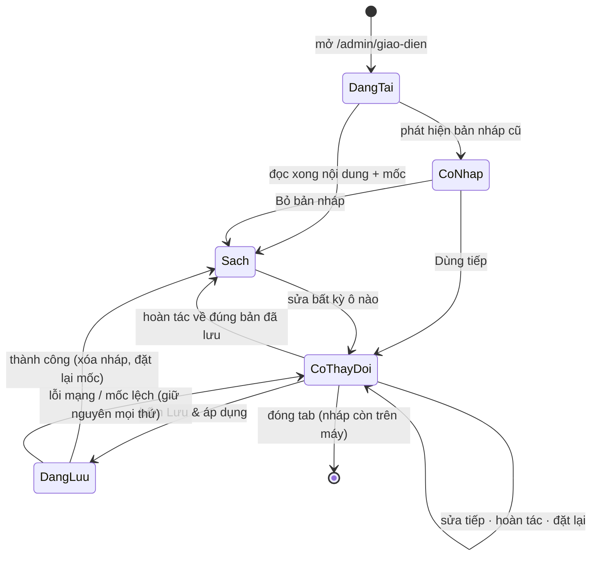

# Feature Spec — Sửa chữ trang chủ trực tiếp

> **PRD:** [`customizer-prd.md`](./customizer-prd.md) · **RFC:** [`customizer-rfc.md`](./customizer-rfc.md) ·
> **Domain:** [`home-content-domain.md`](../../domains/home-content-domain.md)
>
> Tài liệu này mô tả **hành vi nhìn thấy được**: từng vùng màn hình, từng nút, từng ca biên.

---

# 1. Tổng quan

| Mã màn | Đường dẫn | Ai vào được | Việc |
| :-- | :-- | :-- | :-- |
| **AD-C1** | `/admin/giao-dien` → tab *Nội dung trang chủ* | `admin` ⬆ | Sửa chữ trang chủ, xem trước trực tiếp, áp dụng |
| *(AD-B3)* | `/admin/giao-dien` → tab *Dải bài viết* | `admin` ⬆ | Cấu hình hai dải bài — thuộc [phân hệ Bài viết](../blog/blog-spec.md) |
| **SH-C1** | `/` | Mọi người | Trang chủ, chữ lấy từ database |
| *(nội bộ)* | `/?preview=1` | Chỉ dùng trong iframe | Trang chủ ở chế độ nhận nội dung qua `postMessage` |

---

# 2. User Stories

| # | Là | Tôi muốn | Để |
| :-- | :-- | :-- | :-- |
| US-1 | Marketing | Sửa chữ trang chủ mà không cần lập trình viên | Nội dung ra kịp lúc cần |
| US-2 | Marketing | Thấy ngay kết quả khi đang gõ | Không phải đoán rồi chờ deploy mới biết |
| US-3 | Marketing | Xem thử trên màn điện thoại | Biết tiêu đề dài có vỡ bố cục không |
| US-4 | Marketing | Thử rồi bỏ được | Dám nghịch mà không sợ hỏng trang thật |
| US-5 | Admin | Không vô tình đè lên thay đổi của đồng nghiệp | Không mất công của người khác |
| US-6 | Ban giám đốc | Đổi thông điệp chính trong vài phút | Phản ứng kịp với thị trường |

---

# 3. Hành vi chi tiết — AD-C1

## 3.1 Bố cục

```
┌──────────────────────────────────────────────────────────────────────────────┐
│ ✕  Giao diện trang chủ   [🖥][📱]   ● Chưa lưu    Mặc định  Hoàn tác  [LƯU & ÁP DỤNG] │
├───────────────────────────────────────────────────┬──────────────────────────┤
│                                                   │ [Nội dung] [Dải bài viết]│
│                                                   │                          │
│                                                   │ ▸ Thanh điều hướng       │
│              KHUNG XEM TRƯỚC                      │ ▾ Hero          [Đặt lại]│
│         (iframe — trang chủ thật)                 │   Dòng nhãn              │
│                                                   │   [___________]   28/60  │
│         · cuộn được                               │   Tiêu đề — phần đầu     │
│         · bấm được                                │   [___________]   17/60  │
│         · đổi ngay khi gõ bên phải                │   Tiêu đề — phần nhấn    │
│                                                   │   [___________]   22/40  │
│                                                   │   ...                    │
│                                                   │ ▸ Số liệu                │
│                                                   │ ▸ Về chúng tôi           │
├───────────────────────────────────────────────────┴──────────────────────────┤
│ Cập nhật gần nhất: 17/08/2026 13:52 · Hữu Tiến          [Xem trang thật ↗]   │
└──────────────────────────────────────────────────────────────────────────────┘
```

- Panel bên phải rộng **380px**, cuộn độc lập với khung xem trước.
- Dưới **1200px**: panel thu thành ngăn kéo trượt từ phải, mở bằng nút nổi. 🔴 Màn này **không dành
  cho điện thoại** — dưới 900px hiện thẳng một câu: *"Sửa nội dung trang chủ cần màn hình rộng hơn.
  Vui lòng dùng máy tính."* Cố nhồi một màn chia đôi vào 375px là tạo ra thứ không ai dùng được.
- Nền khung xem trước dùng màu xám của theme admin, iframe căn giữa — để thấy rõ mép trang khi ở chế
  độ điện thoại.

## 3.2 Thanh công cụ

| Phần tử | Hành vi |
| :-- | :-- |
| **✕** | Đóng, quay về `/admin`. Có thay đổi chưa lưu → hộp thoại *"Thoát mà không lưu? Bản nháp vẫn được giữ trên máy này."* |
| **🖥 / 📱** | Đổi bề rộng iframe (100% ⇄ **390px**). **Không** tải lại iframe, **không** mất vị trí cuộn, **không** mất nội dung đang sửa |
| **Chỉ báo trạng thái** | `● Chưa lưu` (cam) khi có thay đổi · `Đã lưu` (xám) khi không · `Đã khôi phục bản nháp chưa lưu` (xanh dương) ngay sau khi khôi phục |
| **Mặc định** | Đặt **toàn bộ** về bản gốc. Có hộp thoại xác nhận. 🔴 **Không tự lưu** |
| **Hoàn tác** | Lùi một bước. Khóa (xám) khi hết bước. Có **Làm lại** đi kèm |
| **Lưu & áp dụng** | Nút chính. 🔴 **Nổi bật khi có thay đổi chưa lưu**, mờ đi khi không có gì để lưu |
| **Xem trang thật ↗** | Mở `/` ở tab mới — đối chiếu bản đã áp dụng với bản đang sửa |
| **Dòng cập nhật gần nhất** | `dd/MM/yyyy HH:mm` + tên người sửa. Để hai người cùng làm nhìn thấy nhau **trước khi** đụng nhau |

## 3.3 🔴 Live — hành vi quan trọng nhất của cả màn

**Gõ một ký tự vào bất kỳ ô nào → chữ tương ứng trong khung xem trước đổi ngay.**

| Luật | Chi tiết |
| :-- | :-- |
| **Không bấm gì thêm** | Không có nút "Cập nhật xem trước". Có nút đó nghĩa là không live |
| **Không tải lại iframe** | Không nhấp nháy trắng, **không mất vị trí cuộn**. Đang sửa chân trang thì vẫn ở chân trang |
| **Không gọi máy chủ** | Mở tab Network, gõ 200 ký tự → **không có lời gọi mạng nào** |
| **Không lưu** | Trang chủ thật không đổi cho tới khi bấm *Lưu & áp dụng* |
| **Độ trễ không cảm nhận được** | Trong cùng khung hình với thao tác gõ |

**Ô rỗng thì xem trước hiện gì:**

| Loại trường | Khi rỗng |
| :-- | :-- |
| Bắt buộc | Khung xem trước hiện **giữ chỗ mờ** dạng `[Tiêu đề]` + ô nhập báo đỏ + chặn lưu. Không để trống hoác, vì bố cục sẽ co lại và người dùng tưởng mình vừa làm vỡ trang |
| Tùy chọn | Phần tử **không render**. Các phần tử còn lại liền lại tự nhiên |

## 3.4 Panel — nhóm theo khối

13 nhóm, **đúng thứ tự các khối trên trang**: Thanh điều hướng · Hero · Số liệu · Dải lĩnh vực · Về
chúng tôi · Module · Vì sao chọn · Quy trình · Đối tượng · Bảng giá · Cảm nhận · Câu hỏi · Liên hệ &
Chân trang.

**Hai chiều liên kết panel ⇄ xem trước** — đây là thứ biến một form dài thành một công cụ dùng được:

| Thao tác | Kết quả |
| :-- | :-- |
| Mở một nhóm trong panel | Khung xem trước **cuộn mượt** tới khối đó |
| Bấm vào một khối trong khung xem trước | Panel **mở đúng nhóm** đó, cuộn tới nó, làm nổi trong 1 giây |
| Đặt con trỏ vào một ô | Khối tương ứng trong khung xem trước được **viền nhẹ** (tùy chọn, nếu kịp) |

- **Mở một nhóm tự gập nhóm khác** (accordion). Mở hết 13 nhóm là một trang cuộn dài vô tận.
- Mỗi nhóm có nút **[Đặt lại]** riêng — chỉ đưa **nhóm đó** về mặc định, các nhóm khác giữ nguyên.
- Nhóm có ô đang lỗi → chấm đỏ ở đầu nhóm, kể cả khi đang gập.

## 3.5 Ô nhập

| Kiểu | Giao diện |
| :-- | :-- |
| Chữ ngắn | `TextField` một dòng + **bộ đếm `28/60`** ở góc phải dưới |
| Chữ dài (mô tả) | `TextField` nhiều dòng, tự cao theo nội dung, tối đa 6 dòng rồi cuộn |
| Số (số liệu thống kê) | `TextField` kiểu số, có min/max |

- Bộ đếm chuyển **cam ở 90%** giới hạn, **đỏ khi vượt**.
- Vượt giới hạn: ô viền đỏ, chữ lỗi bên dưới, và **chặn** *Lưu & áp dụng*.
- 🔴 Gõ `<b>đậm</b>` → khung xem trước hiện **đúng chuỗi** `<b>đậm</b>`, không phải chữ đậm. Đây là
  có chủ đích. Trường nào hay bị gõ HTML thì thêm chú thích *"Chữ thuần — thẻ HTML sẽ hiện nguyên
  văn."*
- **Không** có nút "chèn xuống dòng" — muốn ngắt dòng thì dùng đúng trường được thiết kế cho nó (ví
  dụ tiêu đề Hero tách ba mảnh).

## 3.6 Danh sách (module, bước, câu hỏi…)

```
▾ Module                                        [Đặt lại]
  Dòng nhãn   [Hệ sinh thái module      ]  19/60
  Tiêu đề     [Một nền tảng — đầy đủ... ]  42/120
  Mô tả       [Triển khai từng phần...  ] 168/400

  Các module (9/12)
  ┌──────────────────────────────────────────────┐
  │ ⠿  1. 🤝 CRM — Quan hệ khách hàng   ▾   🗑  │
  │ ⠿  2. 🏭 ERP — Hoạch định nguồn lực ▾   🗑  │
  │ ...                                          │
  └──────────────────────────────────────────────┘
  [+ Thêm module]
```

| Thao tác | Hành vi |
| :-- | :-- |
| **Mở một mục** (▾) | Hiện các ô của mục đó: icon (emoji), tiêu đề, mô tả, nhãn |
| **Kéo ⠿** | Đổi thứ tự. Khung xem trước đổi thứ tự **ngay trong lúc kéo** |
| **🗑 Xóa** | Hộp thoại xác nhận **hiện tên mục**. Đã ở mức tối thiểu → nút xóa bị khóa, chú thích *"Cần ít nhất 3 module"* |
| **+ Thêm** | Thêm mục mới với chữ mẫu (`"Tiêu đề module"`), panel tự mở mục đó, khung xem trước cuộn tới. Đã ở mức tối đa → nút khóa, chú thích *"Tối đa 12 module"* |
| **Nhãn mục trong danh sách** | Lấy từ trường tiêu đề của chính mục đó — để nhìn danh sách là biết mục nào là mục nào, không phải "Mục 1, Mục 2" |

## 3.7 Bản nháp

- Tự ghi vào trình duyệt sau mỗi lần gõ (debounce 500ms). Không có nút "lưu nháp" — nút đó chỉ làm
  người dùng phân vân giữa hai kiểu lưu.
- Mở màn có nháp cũ:

  > **Đã khôi phục bản nháp chưa lưu** *(sửa lúc 17/08/2026 13:40)*  [Dùng tiếp] [Bỏ bản nháp]

- 🔴 Nháp được tạo **trước** lần cập nhật gần nhất của người khác → cảnh báo mạnh hơn:

  > ⚠️ Bản nháp này được tạo **trước khi** Hữu Tiến cập nhật nội dung lúc 14:05. Dùng tiếp sẽ ghi đè
  > thay đổi của họ.  [Vẫn dùng] [Bỏ bản nháp]

- **Bỏ bản nháp** có hộp thoại xác nhận — bỏ nhầm là mất trắng công đang dở.
- Nháp bị xóa ngay sau khi *Lưu & áp dụng* thành công.
- Chỉ báo trạng thái phải luôn nói rõ: **nháp ≠ đã lưu**, và nháp **nằm trên máy này**.

## 3.8 Hoàn tác / Làm lại

- Tối đa **50 bước** trong phiên đang mở.
- 🔴 **Gom nhóm theo trường và thời gian**: gõ liên tiếp vào **cùng một ô** trong ~500ms là **một**
  bước. Nếu không, hoàn tác lùi từng ký tự và 50 bước không lùi nổi một câu.
- Thêm/xóa/đổi thứ tự một mục là **một** bước.
- *Đặt lại* (nhóm hoặc toàn bộ) cũng là **một** bước — hoàn tác được. Đây là lưới an toàn cho cú bấm
  nhầm nguy hiểm nhất của màn này.
- Đóng tab là mất lịch sử hoàn tác (nội dung thì vẫn còn trong nháp). Giao diện phải nói vậy trong
  tooltip.

## 3.9 Lưu & áp dụng

```
Bấm "Lưu & áp dụng"
  → Kiểm hợp lệ toàn bộ
      ✗ có lỗi → không gửi đi; cuộn tới ô lỗi đầu tiên, mở nhóm chứa nó, báo:
                 "Còn 2 ô chưa hợp lệ. Sửa xong mới áp dụng được."
      ✓ hợp lệ → nút chuyển sang trạng thái đang chạy (khóa, có vòng quay)
  → Máy chủ so mốc cập nhật
      ✗ lệch  → "Người khác vừa cập nhật nội dung lúc 14:05.
                 Tải lại trang để xem bản mới nhất trước khi lưu."   [Tải lại]
      ✓ khớp  → ghi + làm mới cache
  → Toast xanh "Đã áp dụng. Nội dung mới đã hiển thị trên website."
  → Xóa bản nháp · đặt lại mốc · chỉ báo về "Đã lưu" · lịch sử hoàn tác GIỮ NGUYÊN
```

Lịch sử hoàn tác **không bị xóa sau khi lưu** — lưu xong mới thấy sai và muốn lùi lại là chuyện
thường.

**Cảnh báo rời trang** (`beforeunload`) khi còn thay đổi chưa lưu.

---

# 4. Hành vi trang chủ (SH-C1)

| Tình huống | Hành vi |
| :-- | :-- |
| Bình thường | Đọc nội dung từ DB, thiếu khóa nào lấy mặc định trong mã |
| Chưa ai từng lưu | Toàn bộ lấy mặc định — trang chủ **y hệt hiện tại**, khách không thấy khác biệt gì |
| jsonb hỏng lược đồ | Dùng **nguyên bản mặc định** + ghi `console.warn`. 🔴 Trang chủ **không được vỡ**, không được hiện trang lỗi |
| Vừa có người *Lưu & áp dụng* | Nội dung mới ở **lượt tải kế tiếp** |
| Trường tùy chọn rỗng | Phần tử đó **không render** |

---

# 5. Máy trạng thái của một phiên sửa



Hai luật:

1. **`Sach` nghĩa là nội dung trên màn trùng bản đã lưu** — không phải "chưa đụng vào gì". Hoàn tác
   về đúng bản cũ phải làm chỉ báo trở lại "Đã lưu".
2. **Lỗi khi lưu không làm mất gì.** Nội dung, nháp, lịch sử hoàn tác đều còn nguyên.

---

# 6. Trường hợp biên

| # | Tình huống | Hành vi đúng |
| :-- | :-- | :-- |
| E1 | iframe chưa báo `ready` mà người dùng đã gõ | Nội dung được **xếp hàng**, gửi ngay khi có `ready`. Không mất |
| E2 | iframe không `ready` sau 5 giây | Hiện nút *Tải lại khung xem trước*; panel **vẫn sửa và lưu được** |
| E3 | Nội dung gửi từ origin lạ vào iframe | 🔴 **Bỏ qua hoàn toàn**, không render, không báo lỗi ra màn |
| E4 | Tiêu đề dài tối đa theo `max` | Bố cục **không vỡ** ở 1440px lẫn 375px — điều kiện nghiệm thu, không phải hy vọng |
| E5 | Xóa mục cuối cùng của một danh sách | Bị chặn ở mức tối thiểu, chú thích rõ *"Cần ít nhất N mục"* |
| E6 | Dán 50.000 ký tự vào một ô | Bị cắt/chặn theo `max`, báo tại ô |
| E7 | Hai tab cùng mở màn này trên **cùng một máy** | Hai tab dùng chung một khóa `localStorage` → tab sau ghi đè nháp tab trước. Chấp nhận, nhưng khi tab lấy lại focus thì **đọc lại nháp** và báo nếu đã đổi |
| E8 | Người khác lưu trong lúc mình đang sửa | Không chen ngang lúc đang gõ; chỉ chặn **khi bấm Lưu** (E-mốc) |
| E9 | Mất mạng lúc lưu | Toast đỏ; nội dung + nháp còn nguyên; bấm lại là được |
| E10 | Đặt lại toàn bộ rồi hoàn tác | Về đúng trạng thái trước khi đặt lại |
| E11 | Gõ HTML vào ô | Hiện nguyên văn, không diễn giải (§3.5) |
| E12 | Người dùng mở thẳng `/?preview=1` bằng tay | Thấy đúng **trang chủ hiện tại** (bản đã áp dụng), `noindex`, không rò nội dung nháp của ai |
| E13 | Lược đồ thêm khối mới, DB chưa có khóa đó | Panel hiện khối mới với **giá trị mặc định**; trang chủ cũng vậy. Không lỗi |
| E14 | Vào màn bằng tài khoản không đủ quyền | Chuyển hướng như các màn admin khác |
| E15 | Sửa xong bấm ✕ mà chưa lưu | Hộp thoại: *"Thoát mà không lưu? Bản nháp vẫn được giữ trên máy này."* |

---

# 7. Hành vi UI/UX

| Yếu tố | Quy tắc |
| :-- | :-- |
| **Icon** | Chỉ `@tabler/icons-react` (panel). Khung xem trước là trang chủ thật — không đụng vào |
| **Toast** | `Snackbar` MUI: thành công 3s, lỗi ở lại tới khi bấm |
| **Nút đang chạy** | `useTransition` → khóa + vòng quay. Bấm hai lần không tạo hai lượt ghi |
| **Xác nhận phá hủy** | *Đặt lại*, *Bỏ bản nháp*, *Xóa mục* đều có hộp thoại **nói rõ mất gì** |
| **Ngày giờ** | `Intl.DateTimeFormat("vi-VN")`, formatter khởi tạo một lần ngoài component |
| **Chữ hiển thị** | Tiếng Việt toàn bộ, kể cả thông báo lỗi |
| **Bàn phím** | `Ctrl/Cmd + S` = Lưu & áp dụng · `Ctrl/Cmd + Z` = Hoàn tác (khi con trỏ **không** ở trong ô nhập) |
| **Trạng thái tải** | Skeleton cho panel; khung xem trước hiện vùng xám tới khi iframe `ready` |
| **Tiêu điểm** | Sau khi chặn lưu vì lỗi, con trỏ nhảy vào **ô lỗi đầu tiên** |

---

# 8. Yêu cầu về bề mặt gọi được

Ba hàm ở [RFC §8](./customizer-rfc.md#8-bề-mặt-gọi-được). Ba luật cho giao diện:

1. Client component **không** `import { db }`.
2. Hoàn tác, nháp, đặt lại, Desktop/Mobile, live — **không** lời gọi máy chủ nào.
3. Sau khi lưu thành công, **không** `router.refresh()` cả màn (mất trạng thái panel và vị trí cuộn
   iframe). Chỉ cập nhật mốc và chỉ báo tại chỗ.

---

# 9. Sự kiện & Thông báo

Không có thông báo, không email, không webhook. Dấu vết duy nhất là `activity_logs` với hành động
`settings.home_content.update` và `meta.changed = ['hero','pricing']`.

---

# 10. Tiêu chí nghiệm thu

## Chức năng

- [ ] Mọi trường trong bản kê [Domain §5.3](../../domains/home-content-domain.md#53-bản-kê-khối--trường)
      sửa được từ panel — **không sót khối nào**.
- [ ] Gõ vào bất kỳ ô nào → khung xem trước đổi **ngay**, không nhấp nháy, **không mất vị trí cuộn**.
- [ ] Mở tab Network, gõ 200 ký tự → **không có lời gọi mạng nào**.
- [ ] Bấm 📱 → khung thu về 390px, nội dung đang sửa và vị trí cuộn **giữ nguyên**.
- [ ] Mở một nhóm → khung xem trước cuộn tới đúng khối. Bấm một khối trong khung → panel mở đúng nhóm.
- [ ] Thêm / xóa / kéo đổi thứ tự một module → khung xem trước phản ánh **ngay**.
- [ ] Chạm mức tối thiểu/tối đa của danh sách → nút tương ứng bị khóa kèm chú thích.
- [ ] *Đặt lại* một nhóm → **chỉ** nhóm đó về mặc định; nhóm khác giữ nguyên thứ vừa sửa.
- [ ] *Hoàn tác* lùi theo **câu chữ**, không theo từng ký tự.
- [ ] *Lưu & áp dụng* → mở `/` ở cửa sổ ẩn danh → **thấy nội dung mới**.
- [ ] Chưa lưu → mở `/` ở cửa sổ ẩn danh → **vẫn là nội dung cũ**.
- [ ] Đóng tab giữa chừng, mở lại → *"Đã khôi phục bản nháp chưa lưu"*, nội dung về đúng chỗ đang dở.
- [ ] Hai trình duyệt: A mở, B mở, B lưu, **A lưu → bị chặn** kèm giờ của B.

## Bảo mật

- [ ] `postMessage` từ **origin khác** → iframe **bỏ qua hoàn toàn**.
- [ ] Cha gửi `postMessage` luôn kèm `targetOrigin` cụ thể — **không** `"*"` ở bất kỳ đâu.
- [ ] Gõ `<script>alert(1)</script>` vào một ô → khung xem trước và trang thật hiện **nguyên văn**,
      không có hộp thoại nào.
- [ ] Gọi thẳng `saveHomeContent` khi **chưa đăng nhập** → bị chặn.
- [ ] `/?preview=1` mở bằng tay → chỉ thấy bản đã áp dụng; xem mã nguồn có `noindex`.
- [ ] Dán 1 MB chữ vào một ô → bị chặn theo `max`, không vào được DB.

## Chất lượng

- [ ] **Sau khi bóc chữ (T2), trang chủ trông y hệt trước đó** — so ảnh chụp toàn trang ở 1440px và
      375px.
- [ ] Nội dung "chữ dài tối đa" (mọi trường chạm `max`) → bố cục **không vỡ** ở 1440px và 375px.
- [ ] Xóa hàng `home_content` khỏi DB → trang chủ vẫn chạy, hiện bản mặc định.
- [ ] Ghi rác (`{"v": 99}`) vào `home_content` → trang chủ vẫn chạy, có `console.warn`.
- [ ] Không còn chuỗi tiếng Việt viết cứng nào trong `components/*.tsx`.
- [ ] `lib/data.ts` đã bị xóa; không còn import nào trỏ tới nó.
- [ ] `npm run build` **không lỗi type**; `npm run lint` sạch.
- [ ] Menu *Giao diện trang chủ* **không còn** nhãn "Sắp có".
- [ ] README và `coding-style.md` đã sửa lại chỗ nói *"nội dung tập trung ở `lib/data.ts`"*.

# End
